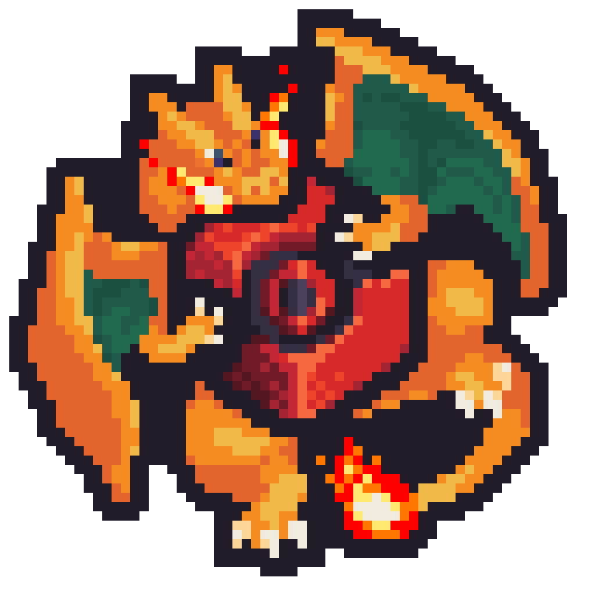

# 🏰 Nous Rejoindre

## Présentation du Serveur



***

### Nos Réseaux


Discord : [https://discord.gg/pokedonjon](https://discord.gg/pokedonjon)

Tik Tok :  [https://www.tiktok.com/@play.pokedonjon.fr](https://www.tiktok.com/@play.pokedonjon.fr)

Instagram : [https://www.instagram.com/pokedonjon/](https://www.instagram.com/pokedonjon/)

Boutique&#x20;


***

### Comment nous rejoindre ?

#### `Version Java`


Afin de rejoindre l'aventure PokeDonjon il vous faudra ;&#x20;

* Une <mark style="color:red;">**version Premium**</mark> de <mark style="color:red;">**Minecraft Java**</mark> _(Crack non autorisé)_
* La version <mark style="color:red;">**1.20.4**</mark> de Minecraft
* L'IP : <mark style="color:red;">**`play.pokedonjon.fr`**</mark>&#x20;


<figure><figcaption></figcaption></figure>

***

#### `Version Bedrock`


_Nous travaillons actuellement sur la version Bedrock. => <mark style="color:red;">**A venir...**</mark> !_


***

<figure><figcaption>
play.pokedonjon.fr
</figcaption></figure>


**IP : play.pokedonjon.fr  /  pokedonjon.fr | 1.20.4**

