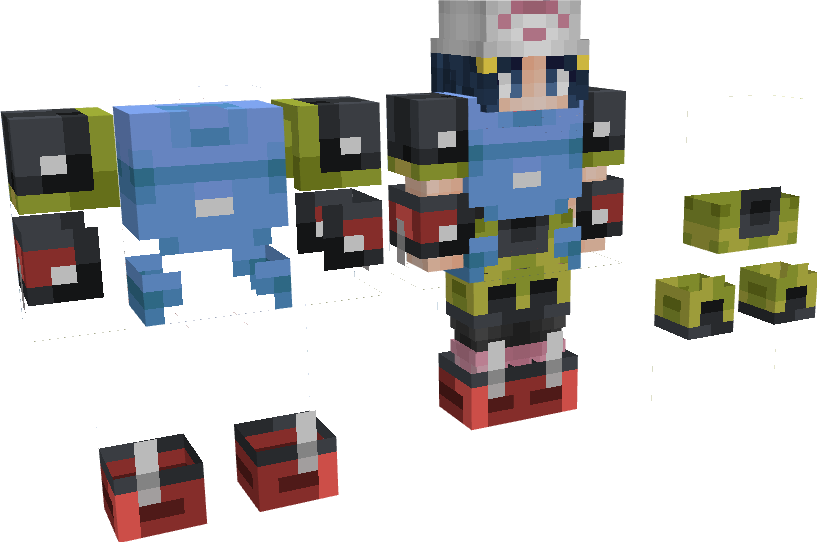

---
layout:
  title:
    visible: true
  description:
    visible: false
  tableOfContents:
    visible: true
  outline:
    visible: true
  pagination:
    visible: false
---

# 📜 PokePass

### Description 📃


Le PokePass vous offrira une multitude de récompense, il dispose de 50 paliers que vous pourrez atteindre en effectuant des quêtes quotidiennes !\
\
Le PokePass premium vous offre des récompenses à chaque palier et il vous propose des quêtes journalière supplémentaires.

> Pour obtenir le PokePass Premium : [https://store.pokedonjon.fr/category/battlepass](https://store.pokedonjon.fr/category/battlepass)


***

### Les PokePass


Vous aurez ici l'historique des PokePass et la liste de leurs récompenses :&#x20;

* [PokePass Saison 1](pokepass.md#pokepass-saison-1) ( Du 29/06/2024 - 04/08/2024)
* A venir..


***

#### PokePass Saison 1&#x20;

<table data-card-size="large" data-view="cards" data-full-width="true"><thead><tr><th align="center"></th><th align="center"></th><th align="center"></th><th></th><th align="center"></th><th align="center"></th><th align="center"></th></tr></thead><tbody><tr><td align="center">PokePass <mark style="color:orange;"><strong>Saison 1</strong></mark> <strong>| ACTUEL</strong></td><td align="center"> <em><mark style="color:green;"><strong>Skin obtenable : Lucario Espace</strong></mark></em></td><td align="center"> <mark style="color:red;">Les Récompenses</mark></td><td><ul><li>2 : x1 PikaBall  | PikaBox  </li><li>4 : x3 Bonbons XP  </li><li>6 : 200 PokeCoins  </li><li>8 : x1 Nettoyeur de Skin  </li><li>10 : 200 PokeCoins  </li><li>12 : x3 Bonbons XP  </li><li>14 : x1 Clé Donjon  <em>(Aléatoire)</em> </li><li>16 : x3 Bonbons XP   </li><li>18 : 200 PokeCoins  </li><li>20 : x1 Nettoyeur de Gemme  </li><li>22 : 200 PokeCoins  </li><li>24 : x3 Bonbons XP  </li><li>26 : 200 PokeCoins   </li><li>28 : x1 Œuf Starter <em>(Aléatoire)</em> </li><li>30 : x3 Bonbons XP  </li><li>32 : x1 Nettoyeur de Gemme  </li><li>34 : x3 Bonbons XP  </li><li>36 : 200 PokeCoins  </li><li>38 : x1 Gemme   <em>(Aléatoire)</em> </li><li>40 : x4 Potions de Soins  </li><li>42 : x3 PikaBalls  | PikaBox  </li><li>44 : 200 PokeCoins  </li><li>46 : x1 Clé Donjon Mega Lucario  </li><li>48 : x1 Œuf de Lucario  </li><li>50 : Skin de Lucario Espace </li></ul></td><td align="center"></td><td align="center"><mark style="color:green;"><strong>Durée du PokePass : Du 29/06/2024 au 04/08/2024</strong></mark></td><td align="center">

</td></tr><tr><td align="center">PokePass <strong>Premium</strong> <mark style="color:orange;"><strong>Saison 1</strong></mark> <strong>| ACTUEL</strong></td><td align="center"> <em><mark style="color:green;"><strong>Skin obtenable : Lucario Shiny Espace</strong></mark></em></td><td align="center"> <mark style="color:red;">Les Récompenses</mark></td><td><ul><li>1 : x3 PikaBalls  | PikaBox </li><li>2 : x1 Griffe D'Aura  <em>(Rareté Aléatoire)</em> </li><li>3 : x1 Œuf Starter <em>(Aléatoire)</em></li><li>4 : x3 Bonbons XP </li><li>5 : x3 Potions de Mana </li><li>6 : 400 PokeCoins </li><li>7 : x1 Bottes Lucario  <em>(Rareté Aléatoire)</em></li><li>8 : x1 Nettoyeur de Skin </li><li>9 : x1 Gemme    <em>(Aléatoire)</em></li><li>10 : 400 PokeCoins </li><li>11 : x1 PikaBall  | PikaBox </li><li>12 : x3 Bonbons XP </li><li>13 : Jambière Lucario  <em>(Rareté Aléatoire)</em></li><li>14 : x1 Ball Donjon Starter  <em>(Aléatoire)</em></li><li>15 : x1 Nettoyeur de Gemme </li><li>16 : x3 Bonbons XP </li><li>17 : x4 Potions de Soins </li><li>18 : 400 PokeCoins </li><li>19 : x1 Plastron Lucario  <em>(Rareté Aléatoire)</em></li><li>20 : x3 PikaBalls  | PikaBox </li><li>21 : x3 PokeBalls  | PokeCaisse </li><li>22 : 400 PokeCoins </li><li>23 : <strong>x1</strong> Casque Lucario   <em>(Rareté Aléatoire)</em></li><li>24 : x3 Bonbons XP </li><li>25 : x1 Œuf de Lucario </li><li>26 : 400 PokeCoins </li><li>27 : x3 PikaBalls  | PikaBox </li><li>28 : 3 Œufs Starters  <em>(Aléatoire)</em></li><li>29 : x1 Skin Shiny Plastron Lucario </li><li>30 :  x1 PikaBall  | PikaBox </li><li>31 :  x3 Potions de Mana </li><li>32 : x1 Nettoyeur de Skin </li><li>33 : x1 Clé Donjon Mega  <em>(Aléatoire)</em></li><li>34 : x3 Bonbons XP </li><li>35 : x1 Nettoyeur de Gemme </li><li>36 : 400 PokeCoins </li><li>37 : x1 IronBall  | Box Paradox </li><li>38 : x1 Gemme   <em>(Aléatoire)</em></li><li>39 : x1 Skin Shiny Plastron Lucario </li><li>40 : x4 Potions de Soins </li><li>41 : x3 PokeBalls  | PokeCaisse </li><li>42 : x3 PikaBalls  | PikaBox </li><li>43 : x1 Skin Shiny Jambière Lucario </li><li>44 : 400 PokeCoins </li><li>45 : x1 PikaBall  | PikaBox </li><li>46 : x1 Clé Donjon Mega Lucario </li><li>47 : x1 Skin Shiny Bottes Lucario </li><li>48 : x3 Œufs de Lucario </li><li>49 : x1 Skin Shiny de la Griffe D'Aura </li><li>50 : Skin Shiny Lucario Espace </li></ul></td><td align="center"><a href="https://store.pokedonjon.fr/category/battlepass"><strong>OBTENIR LE POKEPASS PREMIUM</strong></a></td><td align="center"> <mark style="color:green;"><strong>Durée du PokePass : Du 29/06/2024 au 04/08/2024</strong></mark></td><td align="center"></td></tr></tbody></table>
