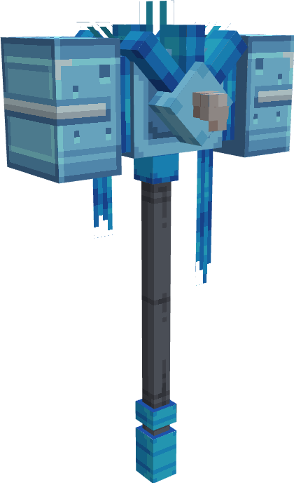

---
layout:
  title:
    visible: false
  description:
    visible: false
  tableOfContents:
    visible: true
  outline:
    visible: true
  pagination:
    visible: true
---

# Brise-Glace

### Description 📃&#x20;


Brise-Glace  est l'arme lié à Artikodin.\
Ce marteau ,bien qu'avec son nom contradictoire, peu manipuler la glace.\
La légendaire raconte qu'il glacerai le sang de son utilisateur si ce dernier ne possède pas un cœur pur.


***

### Comment l'obtenir ❓


Le Brise-Glace  .png>)/ .png>)/ .png>) ne sont pas obtenables.

Le Brise-Glace  .png>)est obtenable sur [Artikodin](../../pokemon/pokedex/artikodin.md) 

Le Brise-Glace  .png>) est obtenable sur  [Artikodin](../../pokemon/pokedex/artikodin.md) 


***

### Compétences et Statistiques 💠


Le Brise-Glace  possède une attaque offensive classique, une compétences offensive et un ultime.\

* Clic Gauche  = Eclat Glace | Attaque de base à distance, ralenti l'ennemie à l'impact. (Consume 1 de mana)
* Clic droit  =  | Compétence, créer des pics de glace du sol qui ralentisse énormément les ennemies.
* Sneak  = Glaciation | Ultime, effectue un saut suivis d'un piqué infligeant des dégâts à tous les ennemies à proximités et les gèles.&#x20;


<table data-full-width="true"><thead><tr><th align="center">Eclat Glace</th><th align="center">Commun</th><th align="center">Rare</th><th align="center">Epique</th><th align="center">Légendaire</th><th align="center">Mythique</th></tr></thead><tbody><tr><td align="center">Dégâts </td><td align="center">5 </td><td align="center"><mark style="color:blue;">6.2</mark> </td><td align="center"><mark style="color:purple;">7.5</mark> </td><td align="center"><mark style="color:yellow;">8.7</mark> </td><td align="center"><mark style="color:red;">10</mark> </td></tr><tr><td align="center">Cooldown </td><td align="center">1 </td><td align="center"><mark style="color:blue;">0.9</mark> </td><td align="center"><mark style="color:purple;">0.8</mark> </td><td align="center"><mark style="color:yellow;">0.7</mark> </td><td align="center"><mark style="color:red;">0.5</mark> </td></tr></tbody></table>

<table data-full-width="true"><thead><tr><th align="center">Stalacticte</th><th align="center">Commun</th><th align="center">Rare</th><th align="center">Épique</th><th align="center">Légendaire</th><th align="center">Mythique</th></tr></thead><tbody><tr><td align="center">Dégâts </td><td align="center">N/A</td><td align="center"><mark style="color:blue;">N/A</mark></td><td align="center"><mark style="color:purple;">5</mark> </td><td align="center"><mark style="color:yellow;">6.5</mark> </td><td align="center"><mark style="color:red;">8</mark> </td></tr><tr><td align="center">Cooldown </td><td align="center">N/A</td><td align="center"><mark style="color:blue;">N/A</mark></td><td align="center"><mark style="color:purple;">5</mark> </td><td align="center"><mark style="color:yellow;">4.5</mark> </td><td align="center"><mark style="color:red;">4</mark> </td></tr></tbody></table>

<table data-full-width="true"><thead><tr><th align="center">Glaciation</th><th align="center">Statistiques</th></tr></thead><tbody><tr><td align="center">Dégâts </td><td align="center">20 </td></tr><tr><td align="center">Cooldown </td><td align="center">10 </td></tr></tbody></table>

***

### Amélioration ⏫


Le Brise-Glace  possède la [Gemme Spéciale d'Artikodin](../gemmes/gemme-speciale-dartikodin.md#gemme-speciale-darme) lui permettant d'obtenir son Ultime Glaciation.


***

### Skins 🎨



<figure><figcaption>
Skin de base du Brise-Glace
</figcaption></figure>



<figure><figcaption>
Skin Shiny du Brise-Glace
</figcaption></figure>



***

### Historique 📖

Cette arme n'a reçu aucun correctif depuis sa sortie.
