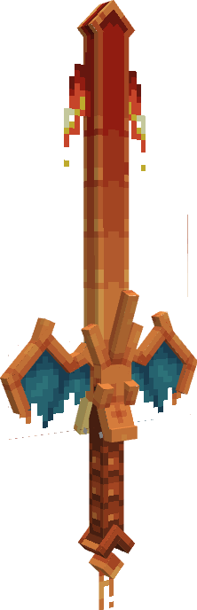

---
layout:
  title:
    visible: false
  description:
    visible: false
  tableOfContents:
    visible: true
  outline:
    visible: true
  pagination:
    visible: true
---

# Épée Draconique

### Description 📃&#x20;


L'Épée Draconique  est l'arme lié à Dracaufeu \
Cette lame forgée grâce aux braises d'un Dracaufeu vous offrira une puissance ardente en combat !\
Attention à ne pas vous brûler les ailes.


***

### Comment l'obtenir ❓


L'Épée Draconique  .png>) est obtenable sur [Salamèche ](../../pokemon/pokedex/salameche/)

L'Épée Draconique  .png>) est obtenable sur [Reptincel ](../../pokemon/pokedex/salameche/a.md)

L'Épée Draconique  .png>) est obtenable sur [Reptincel ](../../pokemon/pokedex/salameche/a.md) et [Dracaufeu ](../../pokemon/pokedex/salameche/a-1.md)

L'Épée Draconique  .png>)est obtenable sur Mega-Dracaufeu 

L'Épée Draconique  .png>) est obtenable sur Meca-Dracaufeu 


***

### Compétences et Statistiques 💠



L'Épée Draconique  possède une attaque offensive classique, une compétences offensive et un ultime.

* Clic Gauche  = Roue de Feu | Attaque au corps à corps classique.
* Clic droit  = Tornade | Compétence, propulse les ennemies dans les airs.&#x20;
* Sneak  = Draco-Météor | Ultime , une météore s'abat sur la cible infligeant des dégâts et brûle les ennemies.


<table data-full-width="true"><thead><tr><th align="center">Roue de Feu</th><th align="center">Commun</th><th align="center">Rare</th><th align="center">Epique</th><th align="center">Légendaire</th><th align="center">Mythique</th></tr></thead><tbody><tr><td align="center">Dégâts </td><td align="center">4.5 </td><td align="center"><mark style="color:blue;">5.6</mark> </td><td align="center"><mark style="color:purple;">6.7</mark> </td><td align="center"><mark style="color:yellow;">7.8</mark> </td><td align="center"><mark style="color:red;">9</mark> </td></tr><tr><td align="center">Cooldown </td><td align="center">0.63 </td><td align="center"><mark style="color:blue;">0.56</mark> </td><td align="center"><mark style="color:purple;">0.5</mark> </td><td align="center"><mark style="color:yellow;">0.45</mark> </td><td align="center"><mark style="color:red;">0.42</mark> </td></tr></tbody></table>

<table data-full-width="true"><thead><tr><th align="center">Tornade</th><th align="center">Commun</th><th align="center">Rare</th><th align="center">Épique</th><th align="center">Légendaire</th><th align="center">Mythique</th></tr></thead><tbody><tr><td align="center">Dégâts  </td><td align="center">N/A</td><td align="center"><mark style="color:blue;">N/A</mark></td><td align="center"><mark style="color:purple;">6</mark> </td><td align="center"><mark style="color:yellow;">8</mark> </td><td align="center"><mark style="color:red;">10</mark> </td></tr><tr><td align="center">Cooldown </td><td align="center">N/A</td><td align="center"><mark style="color:blue;">N/A</mark></td><td align="center"><mark style="color:purple;">3</mark> </td><td align="center"><mark style="color:yellow;">2.5</mark> </td><td align="center"><mark style="color:red;">2</mark> </td></tr></tbody></table>

<table data-full-width="true"><thead><tr><th align="center">Draco-Météor</th><th align="center">Statistiques</th></tr></thead><tbody><tr><td align="center">Dégâts </td><td align="center">20 + brûlure (7-8 secondes) </td></tr><tr><td align="center">Cooldown </td><td align="center">20 </td></tr></tbody></table>

***

### Amélioration ⏫


L'Épée Draconique  possède la [Gemme Spéciale de Dracaufeu](../gemmes/gemme-speciale-de-dracaufeu.md#gemme-speciale-darme) lui permettant d'obtenir son Ultime Draco-Météor.


***

### Skins 🎨



<figure><figcaption>
Skin de base de l'Épée Draconique
</figcaption></figure>



<figure><figcaption>
Skin Shiny de l'épée Draconique
</figcaption></figure>



***

### Historique 📖

Cette arme n'a reçu aucun correctif depuis sa sortie.
