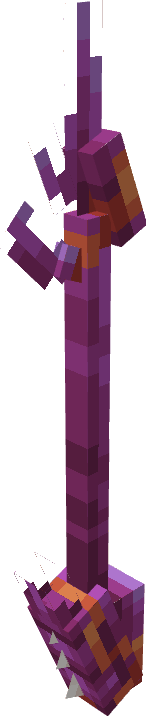

---
layout:
  title:
    visible: false
  description:
    visible: false
  tableOfContents:
    visible: true
  outline:
    visible: true
  pagination:
    visible: true
---

# Épieu Scarabique

### Description 📃&#x20;


L'Épieu Scarabique  est l'arme lié à Scarhino \
Cet épieu à été façonné avec comme base une corne de Scarhino, mieux vaut éviter quelle vous pique !


***

### Comment l'obtenir ❓


L'Épieu Scarabique   .png>) est obtenable sur [Scarhino ](../../pokemon/pokedex/scarhino/)

L'Épieu Scarabique    .png>) est obtenable sur [Scarhino ](../../pokemon/pokedex/scarhino/)

L'Épieu Scarabique    .png>) est obtenable sur [Scarhino ](../../pokemon/pokedex/scarhino/)

L'Épieu Scarabique   .png>)est obtenable sur [Mega-Scarhino](../../pokemon/pokedex/scarhino/a.md) 

L'Épieu Scarabique    .png>) est obtenable sur [Mega-Scarhino](../../pokemon/pokedex/scarhino/a.md)


***

### Compétences et Statistiques 💠


L'Épieu Scarabique  possède une attaque offensive classique, une compétences offensive et un ultime.\

* Clic Gauche  = Taillade | Attaque classique avec une portée augmentée.
* Clic droit  = Picots | Compétence, créer une ligne de picots qui ralenti les ennemies.
* Sneak  = Abri | Ultime défensif , génère 4 boucliers pouvant entièrement encaisser une attaque.


<table data-full-width="true"><thead><tr><th align="center">Taillade</th><th align="center">Commun</th><th align="center">Rare</th><th align="center">Epique</th><th align="center">Légendaire</th><th align="center">Mythique</th></tr></thead><tbody><tr><td align="center">Dégâts </td><td align="center">5.5 </td><td align="center"><mark style="color:blue;">6.8</mark> </td><td align="center"><mark style="color:purple;">8.2</mark> </td><td align="center"><mark style="color:yellow;">9.5</mark> </td><td align="center"><mark style="color:red;">11</mark> </td></tr><tr><td align="center">Cooldown </td><td align="center">0.67 </td><td align="center"><mark style="color:blue;">0.63</mark> </td><td align="center"><mark style="color:purple;">0.59</mark> </td><td align="center"><mark style="color:yellow;">0.56</mark> </td><td align="center"><mark style="color:red;">0.53</mark> </td></tr></tbody></table>

<table data-full-width="true"><thead><tr><th align="center">Picôts</th><th align="center">Commun</th><th align="center">Rare</th><th align="center">Épique</th><th align="center">Légendaire</th><th align="center">Mythique</th></tr></thead><tbody><tr><td align="center">Dégâts </td><td align="center">N/A</td><td align="center"><mark style="color:blue;">N/A</mark></td><td align="center"><mark style="color:purple;">8</mark> </td><td align="center"><mark style="color:yellow;">10</mark> </td><td align="center"><mark style="color:red;">12</mark> </td></tr><tr><td align="center">Cooldown </td><td align="center">N/A</td><td align="center"><mark style="color:blue;">N/A</mark></td><td align="center"><mark style="color:purple;">2</mark> </td><td align="center"><mark style="color:yellow;">1.5</mark> </td><td align="center"><mark style="color:red;">1</mark> </td></tr></tbody></table>

<table data-full-width="true"><thead><tr><th align="center">Abri</th><th align="center">Statistiques</th></tr></thead><tbody><tr><td align="center">Bouclier </td><td align="center">4 </td></tr><tr><td align="center">Cooldown </td><td align="center">15 </td></tr></tbody></table>

***

### Amélioration ⏫


L'Épieu Scarabique  possède la [Gemme Spéciale de Scarhino](../gemmes/gemme-speciale-de-scarhino.md#gemme-speciale-darme) lui permettant d'obtenir son Ultime Abri.


***

### Skins 🎨



<figure><figcaption>
Skin de base de l'Épieu Scarabique
</figcaption></figure>



<figure><figcaption>
Skin Shiny de l'Épieu Scarabique
</figcaption></figure>



***

### Historique 📖

Cette arme n'a reçu aucun correctif depuis sa sortie.
