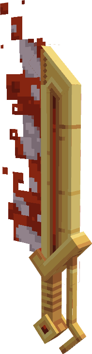

---
layout:
  title:
    visible: false
  description:
    visible: false
  tableOfContents:
    visible: true
  outline:
    visible: true
  pagination:
    visible: true
---

# Lame du Phoenix

### Description 📃&#x20;


La Lame du Phoenix  est l'arme lié à Sulfura \
Cette lame à été forgée dans les flammes sacrée d'un Sulfura, elle condense toute sa chaleur dans sa lame.\
La température du combat risque de grimper drastiquement.


***

### Comment l'obtenir ❓


La Lame du Phoenix  .png>)/ .png>)/ .png>) ne sont pas obtenables.

La Lame du Phoenix  .png>)sont obtenable sur [Sulfura ](../../pokemon/pokedex/sulfura.md)

La Lame du Phoenix   .png>) sont obtenable sur  [Sulfura ](../../pokemon/pokedex/sulfura.md)


***

### Compétences et Statistiques 💠


La Lame du Phoenix  possède une attaque offensive classique, une compétences offensive et un ultime non offensif.\

* Clic Gauche  = Roue de Feu | Attaque au corps à corps classique.
* Clic droit  = Rebondifeu | Compétence, projette une boule de feu sur une longe portée, à l'impact la boule de feu explose et projette de petite flamme infligeant de léger dégâts aux ennemies dans sa portée. La boule de feu brûle également sa cible principale.
* Sneak  = Vol | Ultime, le lanceur prends l'apparence d'un Phoenix le temps d'un instant et s'envole.


<table data-full-width="true"><thead><tr><th align="center">Roue de Feu</th><th align="center">Commun</th><th align="center">Rare</th><th align="center">Epique</th><th align="center">Légendaire</th><th align="center">Mythique</th></tr></thead><tbody><tr><td align="center">Dégâts </td><td align="center">5.5 </td><td align="center"><mark style="color:blue;">6.8</mark> </td><td align="center"><mark style="color:purple;">8.2</mark> </td><td align="center"><mark style="color:yellow;">9.5</mark> </td><td align="center"><mark style="color:red;">22</mark> </td></tr><tr><td align="center">Cooldown </td><td align="center">0.5 </td><td align="center"><mark style="color:blue;">0.45</mark> </td><td align="center"><mark style="color:purple;">0.42</mark> </td><td align="center"><mark style="color:yellow;">0.38</mark> </td><td align="center"><mark style="color:red;">0.36</mark> </td></tr></tbody></table>

<table data-full-width="true"><thead><tr><th align="center">Rebondifeu</th><th align="center">Commun</th><th align="center">Rare</th><th align="center">Épique</th><th align="center">Légendaire</th><th align="center">Mythique</th></tr></thead><tbody><tr><td align="center">Dégâts </td><td align="center">N/A</td><td align="center"><mark style="color:blue;">N/A</mark></td><td align="center"><mark style="color:purple;">10</mark> </td><td align="center"><mark style="color:yellow;">13</mark> </td><td align="center"><mark style="color:red;">16</mark> </td></tr><tr><td align="center">Cooldown </td><td align="center">N/A</td><td align="center"><mark style="color:blue;">N/A</mark></td><td align="center"><mark style="color:purple;">4</mark> </td><td align="center"><mark style="color:yellow;">3.5</mark> </td><td align="center"><mark style="color:red;">3</mark> </td></tr></tbody></table>

<table data-full-width="true"><thead><tr><th align="center">Vol</th><th align="center">Statistiques</th></tr></thead><tbody><tr><td align="center">Duration</td><td align="center">12 secondes</td></tr><tr><td align="center">Cooldown </td><td align="center">20 </td></tr></tbody></table>

***

### Amélioration ⏫


La Lame du Phoenix  possède la [Gemme Spéciale de Sulfura](../gemmes/gemme-speciale-de-sulfura.md#gemme-speciale-darme) lui permettant d'obtenir son Ultime Vol.


***

### Skins 🎨



<figure><figcaption>
Skin de base de la Lame du Phoenix
</figcaption></figure>



<figure><figcaption>
Skin Shiny de la Lame du Phoenix
</figcaption></figure>



***

### Historique 📖

Cette arme n'a reçu aucun correctif depuis sa sortie.
