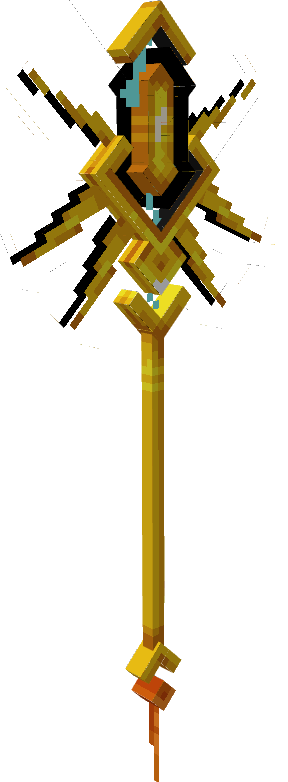

---
layout:
  title:
    visible: false
  description:
    visible: false
  tableOfContents:
    visible: true
  outline:
    visible: true
  pagination:
    visible: true
---

# Scepthor

### Description 📃&#x20;


Le Scepthor  est l'arme lié à Electhor .\
Ce sceptre légendaire manipule l'électricité, en un petit claquement de doigt il peut créer un éclair.\
Attention aux ondes de choc !


***

### Comment l'obtenir ❓


Le Scepthor  .png>)/ .png>)/ .png>) ne sont pas obtenables.

Le Scepthor .png>)est obtenable sur [Electhor](../../pokemon/pokedex/electhor.md) 

Le Scepthor  .png>) est obtenable sur  [Electhor](../../pokemon/pokedex/electhor.md) 


***

### Compétences et Statistiques 💠


Scepthor  possède une attaque offensive classique, une compétences offensive et un ultime.\

* Clic Gauche  = Coup D'jus | Attaque de base.
* Clic droit  = Tonnerre | Compétence, créer une ligne d'éclaire qui étourdis les ennemies.
* Sneak  = Fatal-Foudre | Ultime, effectue un saut suivis d'un piqué, étourdis tout les ennemies à la retombée. Génère quelques éclaire aléatoire autour du lanceur.


<table data-full-width="true"><thead><tr><th align="center">Coup D'jus</th><th align="center">Commun</th><th align="center">Rare</th><th align="center">Epique</th><th align="center">Légendaire</th><th align="center">Mythique</th></tr></thead><tbody><tr><td align="center">Dégâts </td><td align="center">6 </td><td align="center"><mark style="color:blue;">7.5</mark> </td><td align="center"><mark style="color:purple;">9</mark> </td><td align="center"><mark style="color:yellow;">10.5</mark> </td><td align="center"><mark style="color:red;">12</mark> </td></tr><tr><td align="center">Cooldown </td><td align="center">0.5 </td><td align="center"><mark style="color:blue;">0.45</mark> </td><td align="center"><mark style="color:purple;">0.42</mark> </td><td align="center"><mark style="color:yellow;">0.38</mark> </td><td align="center"><mark style="color:red;">0.36</mark> </td></tr></tbody></table>

<table data-full-width="true"><thead><tr><th align="center">Tonnerre</th><th align="center">Commun</th><th align="center">Rare</th><th align="center">Épique</th><th align="center">Légendaire</th><th align="center">Mythique</th></tr></thead><tbody><tr><td align="center">Dégâts </td><td align="center">N/A</td><td align="center"><mark style="color:blue;">N/A</mark></td><td align="center"><mark style="color:purple;">9</mark> </td><td align="center"><mark style="color:yellow;">10.5</mark> </td><td align="center"><mark style="color:red;">12</mark> </td></tr><tr><td align="center">Cooldown </td><td align="center">N/A</td><td align="center"><mark style="color:blue;">N/A</mark></td><td align="center"><mark style="color:purple;">8</mark> </td><td align="center"><mark style="color:yellow;">7.5</mark> </td><td align="center"><mark style="color:red;">7</mark> </td></tr></tbody></table>

<table data-full-width="true"><thead><tr><th align="center">Fatal-Foudre</th><th align="center">Statistiques</th></tr></thead><tbody><tr><td align="center">Dégâts </td><td align="center">24 </td></tr><tr><td align="center">Cooldown </td><td align="center">15 </td></tr></tbody></table>

***

### Amélioration ⏫


Le Scepthor  possède la [Gemme Spéciale d'](../gemmes/gemme-speciale-dartikodin.md#gemme-speciale-darme)[Electhor](../gemmes/gemme-speciale-delecthor.md#gemme-speciale-darme) lui permettant d'obtenir son Ultime Fatal-Foudre.


***

### Skins 🎨



<figure><figcaption>
Skin de base du Scepthor
</figcaption></figure>



<figure><figcaption>
Skin Shiny du Scepthor
</figcaption></figure>



***

### Historique 📖

Cette arme n'a reçu aucun correctif depuis sa sortie.
