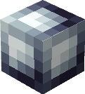

---
layout:
  title:
    visible: true
  description:
    visible: false
  tableOfContents:
    visible: true
  outline:
    visible: true
  pagination:
    visible: true
---

# 💎 Gemmes

### Description 📃


Malgré leurs petites tailles, les gemmes seront pour votre aventure un atout incontournable !\
Ces dernières vous apportent des bonus non négligeables sur l'entièreté de votre équipement.

Certaines renferme un pouvoir mystérieux qui semble être relié à des Pokémons !


***

### Les Catégories de Gemmes 🔆

Vous aurez la possibilité de trouver différentes sortes de gemmes, en voici les catégories ;

* [**Gemme de puissance**](gemme-de-puissance.md) **(Arme)**
* [**Gemme de pouvoir**](gemme-de-pouvoir.md) **(Armure)**
* [**Gemme de résistance**](gemme-de-resistance.md) **(Armure)**


Ces gemmes sont applicables sur des catégories et sur des pièces d'équipement spécifique.


Vous pourrez aussi trouver des Gemmes spéciales !

* **Gemme Spéciale d'arme**&#x20;
* **Gemme Spéciale d'armure**


Ces dernières sont beaucoup plus rares, elles renferment un énorme pouvoir mais ne peuvent être appliquées que sur une pièce d'équipement ou une arme spécifique à laquelle elle est reliée.


***

### Apparences 🎨

Les gemmes vont changer de couleur en fonction de leur rareté ;

|                                   Commune                                  |                                    Rare                                   |                                    Epique                                   |                                  Légendaire                                 |                                 Mythique                                 |
| :------------------------------------------------------------------------: | :-----------------------------------------------------------------------: | :-------------------------------------------------------------------------: | :-------------------------------------------------------------------------: | :----------------------------------------------------------------------: |
|  |  |  |  |  |

\
Les gemmes spéciale possède une apparence bien spécifique ;

|                                     Spéciale Arme                                    |                                    Spéciale Armure                                   |
| :----------------------------------------------------------------------------------: | :----------------------------------------------------------------------------------: |
|  |  |


Les gemmes Spéciale possède la rareté Mythique uniquement.


***

### Liste des Gemmes

#### Gemmes classique

* [Gemme de Puissance](gemme-de-puissance.md)
* [Gemme de Pouvoir](gemme-de-pouvoir.md)
* [Gemme de Résistance](gemme-de-resistance.md)

#### Gemmes Spéciale

* [Gemme Spéciale de Florizarre](gemme-speciale-de-florizarre.md)
* [Gemme Spéciale de Tortank](gemme-speciale-de-tortank.md)
* [Gemme Spéciale de Dracaufeu](gemme-speciale-de-dracaufeu.md)
* [Gemme Spéciale de Scarhino](gemme-speciale-de-scarhino.md)
* [Gemme Spéciale de Steelix](gemme-speciale-de-steelix.md)
* [Gemme Spéciale de Lucario](gemme-speciale-de-lucario.md)
* [Gemme Spéciale de Artikodin](gemme-speciale-dartikodin.md)
* [Gemme Spéciale de Electhor](gemme-speciale-delecthor.md)
* [Gemme Spéciale de Sulfura](gemme-speciale-de-sulfura.md)

***

### Historique 📖

Cette page n'a reçu aucune modification.&#x20;
