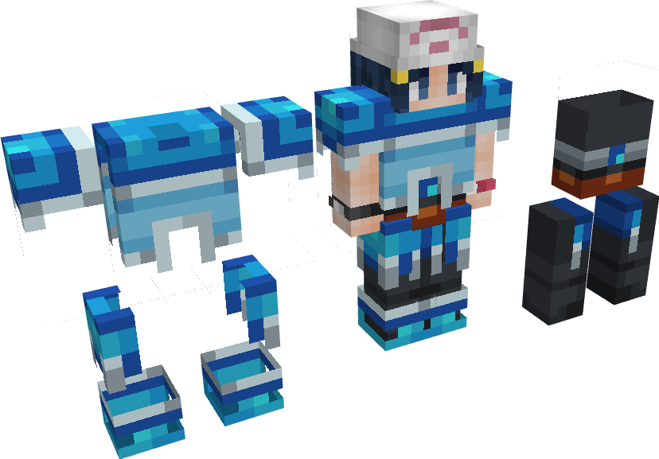
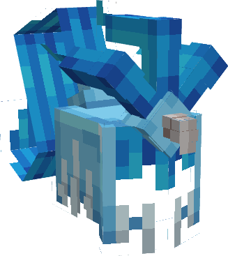

---
layout:
  title:
    visible: true
  description:
    visible: false
  tableOfContents:
    visible: true
  outline:
    visible: true
  pagination:
    visible: true
---

# Gemme Spéciale d'Artikodin

### Description 📃

Ils existent 2 formes de Gemmes Spéciales d'Artikodin, celle pour les armes  et celle pour les armures .\
\
La Gemme destinée aux armes  permet de débloquer la 3ème compétence Glaciation sur le [Brise-Glace](../armes/brise-glace.md) .\
\
La Gemme destinée aux armures  permet d'augmenter le nombre de point de vie  et de point de mana  ainsi que d'augmenter la résistance aux dégâts physique  présent sur les pièces d'[Armure d'Artikodin](../armures/armure-dartikodin.md) .&#x20;


Ces dernières sont applicables **uniquement et respectivement** sur le [Brise-Glace](../armes/brise-glace.md)  et sur  le Casque d'Artikodin .


***

### Comment les obtenir ❓


Vous pourrez obtenir les Gemmes Spéciale d'Artikodin en ouvrant des  [PikaBox ](../../fonctionnement-du-serveur/boxes.md#contenu-des-boxes)


***

### Statistiques 📊

#### Gemme Spéciale D'Arme 

* Ajout de la 3ème compétence Glaciation sur le [Brise-Glace](../armes/brise-glace.md)  (Sneak) 
* Diminution du cooldown  des compétences du [Brise-Glace](../armes/brise-glace.md)  | 3% - 15%

#### Gemme Spéciale D'Armure 

* Augmentation du nombre de points de vie  du Casque d'Artikodin  | 15 - 25
* Augmentation du nombre de points de mana  du Casque d'Artikodin | 5 - 10
* Diminution des dégâts physique  reçu du Casque d'Artikodin  | 0% - 10%


Les pourcentages des Gemmes Spéciales sont également soumis à l'aléatoire, vous pourrez obtenir plusieurs Gemmes Spéciales avec des pourcentages différents.


***

### Historique 📖

Cette gemme n'a reçu aucune modification depuis sa sortie.
