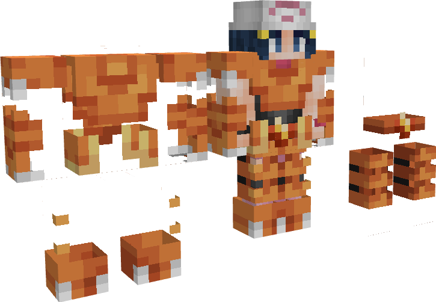
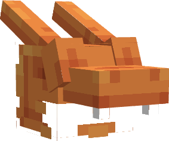

---
layout:
  title:
    visible: true
  description:
    visible: false
  tableOfContents:
    visible: true
  outline:
    visible: true
  pagination:
    visible: true
---

# Gemme Spéciale de Dracaufeu

### Description 📃

Ils existent 2 formes de Gemmes Spéciales de Dracaufeu, celle pour les armes  et celle pour les armures  .\
\
La Gemme destinée aux armes  permet de débloquer la 3ème compétence Draco-Météor sur l'[Épée Draconique](../armes/epee-draconique.md)  .\
\
La Gemme destinée aux armures  permet d'augmenter la quantités de Mana  ainsi que la régénération de mana  présent sur les pièces d'Armure de Dracaufeu .&#x20;


Ces dernières sont applicables **uniquement et respectivement** sur l'[Épée Draconique](../armes/epee-draconique.md)  et sur le Casque de Dracaufeu .


***

### Comment les obtenir ❓


Vous pourrez obtenir les Gemmes Spéciale de Dracaufeu en ouvrant des  [PikaBox ](../../fonctionnement-du-serveur/boxes.md#contenu-des-boxes)


***

### Statistiques 📊

#### Gemme Spéciale D'Arme 

* Ajout de la 3ème compétence Draco-Météor sur l'[Épée Draconique](../armes/epee-draconique.md)  (Sneak) 
* Augmentation des dégâts  des compétences de l'[Épée Draconique](../armes/epee-draconique.md)  de | **5**% - 20%

#### Gemme Spéciale D'Armure 

* Augmentation des points de mana  du Casque de Dracaufeu  | 5 - 10
* Augmentation de la régénération de mana du Casque de Dracaufeu   | 0,4 - 0,8


Les pourcentages des Gemmes Spéciales sont également soumis à l'aléatoire, vous pourrez obtenir plusieurs Gemmes Spéciales avec des pourcentages différents.


***

### Historique 📖

Cette gemme n'a reçu aucune modification depuis sa sortie.
