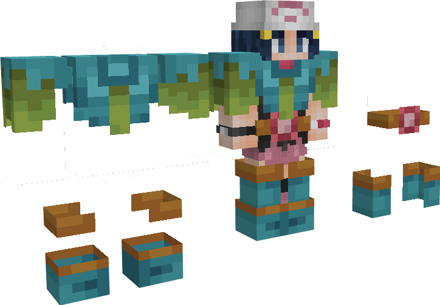

---
layout:
  title:
    visible: true
  description:
    visible: false
  tableOfContents:
    visible: true
  outline:
    visible: true
  pagination:
    visible: true
---

# Gemme Spéciale de Florizarre

### Description 📃

Ils existent 2 formes de Gemmes Spéciales de Florizarre, celle pour les armes  et celle pour les armures  .\
\
La Gemme destinée aux armes  permet de débloquer la 3ème compétence Champ Herbu sur le [Sceptre Florazur](../armes/sceptre-florazur.md)  .\
\
La Gemme destinée aux armures  permet d'augmenter les points de vie  ainsi que la régénération de vie  et de mana  présents sur les pièces d'Armure de Florizarre  .&#x20;


Ces dernières sont applicables **uniquement et respectivement** sur le [Sceptre Florazur](../armes/sceptre-florazur.md)  et sur  le Casque de Florizarre  .


***

### Comment les obtenir ❓


Vous pourrez obtenir des gemmes Spéciales de Florizarre en ouvrant des [PikaBox ](../../fonctionnement-du-serveur/boxes.md#contenu-des-boxes)


***

### Statistiques 📊

#### Gemme Spéciale D'Arme 

* Ajout de la 3ème compétence Champ Herbu sur le [Sceptre Florazur](../armes/sceptre-florazur.md)  (Sneak) 
* Diminution du cooldown  des compétences du  [Sceptre Florazur](../armes/sceptre-florazur.md) de | 3% - 15%

#### Gemme Spéciale D'Armure 

* Augmentation des points de vie du Casque de Florizarre  | 8 - 16
* Augmentation de la régénération de point de vie  du Casque de Florizarre  | 0,4 - 0,8
* Augmentation de la régénération de mana du Casque de Florizarre  | 0,4 - 0,8


Les pourcentages des Gemmes Spéciales sont également soumis à l'aléatoire, vous pourrez obtenir plusieurs Gemmes Spéciales avec des pourcentages différents.


***

### Historique 📖

Cette gemme n'a reçu aucune modification depuis sa sortie.
