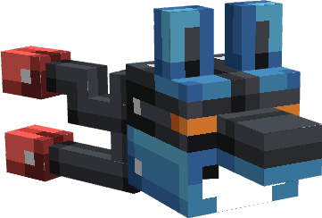

---
layout:
  title:
    visible: true
  description:
    visible: false
  tableOfContents:
    visible: true
  outline:
    visible: true
  pagination:
    visible: true
---

# Gemme Spéciale de Lucario

### Description 📃

Ils existent 2 formes de Gemmes Spéciales de Lucario, celle pour les armes  et celle pour les armures  .\
\
La Gemme destinée aux armes  permet de débloquer la 3ème compétence Damoclès sur la  [Griffe D'Aura](../armes/griffe-daura.md)  .\
\
La Gemme destinée aux armures  permet d'augmenter l'effet d'esquive  présent sur les pièces d'[Armure de Lucario](../armures/armure-de-lucario.md) .&#x20;


Ces dernières sont applicables **uniquement et respectivement** sur la [Griffe D'Aura](../armes/griffe-daura.md)   et sur  le Casque de Lucario .


***

### Comment les obtenir ❓


Vous pourrez obtenir les Gemmes Spéciale de Lucario en ouvrant des  [PikaBox ](../../fonctionnement-du-serveur/boxes.md#contenu-des-boxes)


***

### Statistiques 📊

#### Gemme Spéciale D'Arme 

* Ajout de la 3ème compétence Damoclès sur la [Griffe D'Aura](../armes/griffe-daura.md)  (Sneak) 
* Augmentation des dégâts  des compétences de la  [Griffe D'Aura](../armes/griffe-daura.md)   de | **5**% - 20%

#### Gemme Spéciale D'Armure 

* Augmentation des taux d'esquive  du Casque de Lucario  | 15% - 30%
* Diminution du cooldown d'esquive  du Casque de Lucario  | 25% - 50%


Les pourcentages des Gemmes Spéciales sont également soumis à l'aléatoire, vous pourrez obtenir plusieurs Gemmes Spéciales avec des pourcentages différents.


***

### Historique 📖

Cette gemme n'a reçu aucune modification depuis sa sortie.
