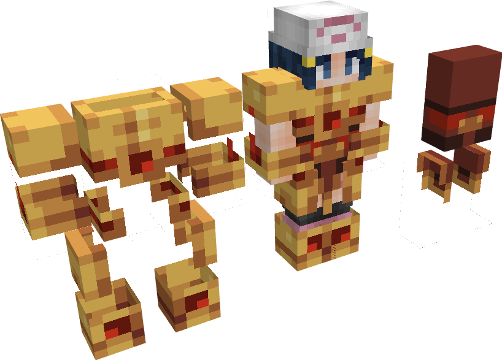
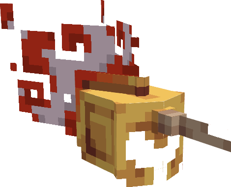

---
layout:
  title:
    visible: true
  description:
    visible: false
  tableOfContents:
    visible: true
  outline:
    visible: true
  pagination:
    visible: true
---

# Gemme Spéciale de Sulfura

### Description 📃

Ils existent 2 formes de Gemmes Spéciales de Sulfura, celle pour les armes  et celle pour les armures .\
\
La Gemme destinée aux armes  permet de débloquer la 3ème compétence Vol sur la [Lame Du Phoenix ](../armes/lame-du-phoenix.md) .\
\
La Gemme destinée aux armure  permet d'augmenter la quantités de point de vie , de la régénération de mana  ainsi qu'une réduction des dégâts de feu  sur les pièces d'[Armure de Sulfura](../armures/armure-de-sulfura.md) .&#x20;


Ces dernières sont applicables **uniquement et respectivement** sur la [Lame Du Phoenix ](../armes/lame-du-phoenix.md)  et sur le Casque de Sulfura .


***

### Comment les obtenir ❓


Vous pourrez obtenir les Gemmes Spéciale de Sulfura en ouvrant des  [PikaBox ](../../fonctionnement-du-serveur/boxes.md#contenu-des-boxes)


***

### Statistiques 📊

#### Gemme Spéciale D'Arme 

* Ajout de la 3ème compétence Vol sur la [Lame Du Phoenix ](../armes/lame-du-phoenix.md)  (Sneak) 
* Augmentation des dégâts  des compétences de la [Lame Du Phoenix ](../armes/lame-du-phoenix.md)  de | **5**% - 20%

#### Gemme Spéciale D'Armure 

* Augmentation des points de vie  du Casque de Sulfura  | 10 - 20
* Augmentation de la régénération de mana  du Casque de Sulfura  | 0,5 - 1
* Augmentation de la résistance aux dégâts de feu  du Casque de Sulfura  | 30% - 40%


Les pourcentages des Gemmes Spéciales sont également soumis à l'aléatoire, vous pourrez obtenir plusieurs Gemmes Spéciales avec des pourcentages différents.


***

### Historique 📖

Cette gemme n'a reçu aucune modification depuis sa sortie.
