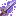

---
layout:
  title:
    visible: true
  description:
    visible: false
  tableOfContents:
    visible: true
  outline:
    visible: true
  pagination:
    visible: true
---

# Gemme Spéciale de Tortank

### Description 📃

Ils existent 2 formes de Gemmes Spéciales de Tortank, celle pour les armes  et celle pour les armures  .\
\
La Gemme destinée aux armes  permet de débloquer la 3ème compétence Cascade sur l'[Hydro-Canon](../armes/hydro-canon.md)  .\
\
La Gemme destinée aux armures  permet d'augmenter l'effet de blocage  ainsi que la réduction de dégâts  présent sur les pièces d'Armure de Tortank .&#x20;


Ces dernières sont applicables **uniquement et respectivement** sur l'[Hydro-Canon](../armes/hydro-canon.md)  et sur  le Casque de Tortank .


***

### Comment les obtenir ❓


Vous pourrez obtenir des gemmes Spéciales de Tortank en ouvrant des [PikaBox ](../../fonctionnement-du-serveur/boxes.md#contenu-des-boxes)


***

### Statistiques 📊

#### Gemme Spéciale D'Arme 

* Ajout de la 3ème compétence Cascade sur l'[Hydro-Canon](../armes/hydro-canon.md)  (Sneak) 
* Diminution du cooldown  des compétences de l'[Hydro-Canon](../armes/hydro-canon.md) | 3% - 15%

#### Gemme Spéciale D'Armure 

* Augmentation de l'efficacité du blocages  du Casque de Tortank  | 10% - 20%
* Augmentation des taux de blocages  du Casque de Tortank  | 7% - 14%
* Diminution des dégâts  reçu du Casque de Tortank  | 0% - 10%


Les pourcentages des Gemmes Spéciales sont également soumis à l'aléatoire, vous pourrez obtenir plusieurs Gemmes Spéciales avec des pourcentages différents.


***

### Historique 📖

Cette gemme n'a reçu aucune modification depuis sa sortie.
