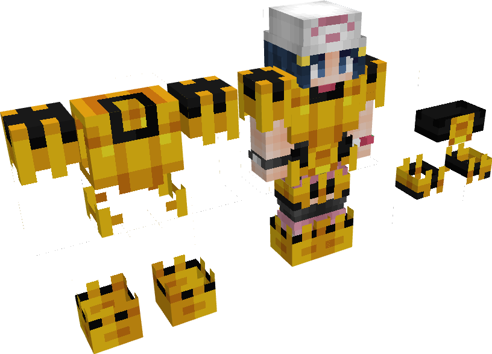
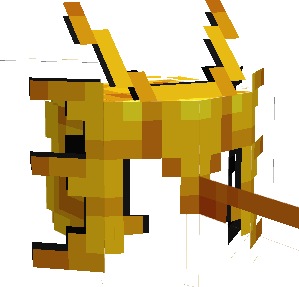

---
layout:
  title:
    visible: true
  description:
    visible: false
  tableOfContents:
    visible: true
  outline:
    visible: true
  pagination:
    visible: true
---

# Gemme Spéciale d'Electhor

### Description 📃

Ils existent 2 formes de Gemmes Spéciales d'Electhor, celle pour les armes  et celle pour les armures .\
\
La Gemme destinée aux armes  permet de débloquer la 3ème compétence Fatal-Foudre sur le [Scepthor  ](../armes/scepthor.md).\
\
La Gemme destinée aux armures  permet d'augmenter l'effet d'esquive  ainsi que le nombre de point de mana  présent sur les pièces d'[Armure d'Electhor](../armures/armure-delecthor.md) .&#x20;


Ces dernières sont applicables **uniquement et respectivement** sur le [Scepthor  ](../armes/scepthor.md) et sur  le Casque d'Electhor .


***

### Comment les obtenir ❓


Vous pourrez obtenir les Gemmes Spéciale d'Electhor en ouvrant des  [PikaBox ](../../fonctionnement-du-serveur/boxes.md#contenu-des-boxes)


***

### Statistiques 📊

#### Gemme Spéciale D'Arme 

* Ajout de la 3ème compétence Fatal-Foudre sur le  [Scepthor ](../armes/scepthor.md) (Sneak) 
* Augmentation des dégâts  des compétences de le  [Scepthor  ](../armes/scepthor.md)| **5**% - 20%

#### Gemme Spéciale D'Armure 

* Augmentation du nombre de points de mana  du Casque d'Electhor  | 7,5 - 15
* Augmentation du taux d'esquive  du Casque d'Electhor  | 20% - 40%
* Diminution du cooldown d'esquive  du Casque d'Electhor  | 25% - 50%


Les pourcentages des Gemmes Spéciales sont également soumis à l'aléatoire, vous pourrez obtenir plusieurs Gemmes Spéciales avec des pourcentages différents.


***

### Historique 📖

Cette gemme n'a reçu aucune modification depuis sa sortie.
