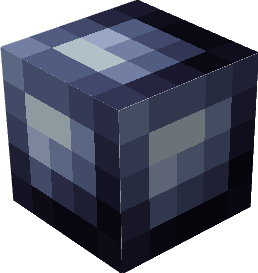
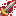
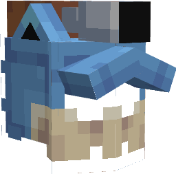
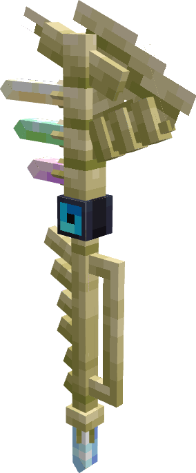
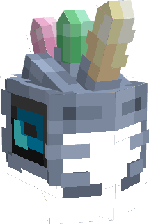

# 🎁 Boxes

### Description 📃


Dans PokeDonjon vous pourrez retrouver différente types de boxes uniques !\
\
Chaque box dispose d'une liste items, de pokemon, de cosmétique ou de PokeCoins différentes.\
\
\- La PokeBox  est la box de base, vous obtiendrez des clés grâce [aux votes](../pokedonjon/voter-pour-pokedonjon.md).\
\
\- La PikaBox est la box dédiée aux [Gemmes](../equipement/gemmes/), celle-ci vous permettra d'améliorer votre équipement afin de devenir le meilleur chasseur de Donjon.\
\
\- La Box Paradox  est une boxe avec des récompenses intéressante, vous pourrez obtenir des clés grâce à des récompenses de jeu ou alors via le rang [Paradox ](../pokedonjon/les-rangs.md#les-rangs-boutique)obtenable ICI. \
\
\- La Box Gigamax  est la seconde meilleure box avec des récompenses très alléchantes, similairement à la Paradox vous pourrez obtenir des clefs grâce à des récompenses de jeux ou bien via le rang [Gigamax](../pokedonjon/les-rangs.md#les-rangs-boutique) obtenables ICI.\
\
\- La Box Fabuleux  est la meilleure box avec des récompenses très généreuse, similairement à la Paradox vous pourrez obtenir des clefs grâce à des récompenses unique de jeu ou bien via le rang [Fabuleux](../pokedonjon/les-rangs.md#les-rangs-boutique) obtenables ICI.


***

### Contenu des Boxes

<table data-card-size="large" data-view="cards" data-full-width="true"><thead><tr><th align="center"></th><th align="center"></th><th align="center"></th><th></th><th align="center"></th><th align="center"></th></tr></thead><tbody><tr><td align="center"><strong>PokeBox</strong> </td><td align="center"></td><td align="center"> <mark style="color:red;"><strong>Récompenses</strong></mark></td><td><ul><li><mark style="color:blue;"><strong>30%</strong></mark> | 50 PokeCoins </li><li><mark style="color:blue;"><strong>30%</strong></mark> | 150 PokeCoins </li><li><mark style="color:blue;"><strong>30%</strong></mark> | x1 Potion de Mana </li><li><mark style="color:blue;"><strong>30%</strong></mark> | x1 Potion de Soin </li><li><mark style="color:blue;"><strong>30%</strong></mark> | x1 Gemme   <em>(Aléatoire)</em></li><li><mark style="color:blue;"><strong>25%</strong></mark> | x1 Bonbon XP </li><li><mark style="color:blue;"><strong>25%</strong></mark> | x1 Poképee  </li><li><mark style="color:blue;"><strong>15%</strong></mark> | x1 Gemme   <em>(Aléatoire)</em></li><li><mark style="color:blue;"><strong>15%</strong></mark> | x1 Poképee  </li><li><mark style="color:blue;"><strong>5%</strong></mark> | x1 Poképee  </li><li><mark style="color:blue;"><strong>5%</strong></mark> | x1 PikaBall  | PikaBox </li></ul></td><td align="center"> <mark style="color:red;"><strong>Obtenir la clé</strong></mark> </td><td align="center"><strong>-> En votant</strong> </td></tr><tr><td align="center"><strong>PikaBox</strong> </td><td align="center"></td><td align="center"> <mark style="color:red;"><strong>Récompenses</strong></mark></td><td><ul><li><mark style="color:blue;"><strong>40%</strong></mark> | x1 Gemme   <em>(Aléatoire)</em></li><li><mark style="color:blue;"><strong>30%</strong></mark> | x1 Gemme   <em>(Aléatoire)</em></li><li><mark style="color:blue;"><strong>15%</strong></mark> | x1 Gemme  <em>(Aléatoire)</em></li><li><mark style="color:blue;"><strong>6%</strong></mark> | x1 Gemme   <em>(Aléatoire)</em></li><li><mark style="color:blue;"><strong>5%</strong></mark> | x1 Gemme Spéciale   <em>(Aléatoire)</em></li><li><mark style="color:blue;"><strong>5%</strong></mark> | x1 Gemme Spéciale   <em>(Aléatoire)</em></li><li><mark style="color:blue;"><strong>1%</strong></mark> | x1 Gemme   <em>(Aléatoire)</em></li></ul></td><td align="center"> <mark style="color:red;"><strong>Obtenir la clé</strong></mark> </td><td align="center">-> Récompense / Boutique</td></tr><tr><td align="center"><strong>Box Paradox</strong></td><td align="center"></td><td align="center"> <mark style="color:red;"><strong>Récompenses</strong></mark></td><td><ul><li><mark style="color:blue;"><strong>30%</strong></mark> | 400 PokeCoins </li><li><mark style="color:blue;"><strong>30%</strong></mark> | 800 PokeCoins </li><li><mark style="color:blue;"><strong>30%</strong></mark> | x8 Bonbon XP </li><li><mark style="color:blue;"><strong>30%</strong></mark> | x1 Arme   <em>(Aléatoire)</em></li><li><mark style="color:blue;"><strong>30%</strong></mark> | x1 Casque   <em>(Aléatoire)</em></li><li><mark style="color:blue;"><strong>25%</strong></mark> | x1 Arme   <em>(Aléatoire)</em></li><li><mark style="color:blue;"><strong>25%</strong></mark> |  x1 Casque   <em>(Aléatoire)</em></li><li><mark style="color:blue;"><strong>25%</strong></mark> | x1 Œuf Starter <em>(Aléatoire)</em></li><li><mark style="color:blue;"><strong>15%</strong></mark> | x1 Skin D'Arme Shiny <em>(Aléatoire)</em></li><li><mark style="color:blue;"><strong>10%</strong></mark> | x3 Œuf Starters <em>(Aléatoire)</em> </li><li><mark style="color:blue;"><strong>5%</strong></mark> | x2 IronBall  | Box Paradox  </li><li><mark style="color:blue;"><strong>1%</strong></mark> | x1 DracoBall  | Box Gigamax  </li></ul></td><td align="center"> <mark style="color:red;"><strong>Obtenir la clé</strong></mark> </td><td align="center">-> Récompense / Rang Paradox / Boutique</td></tr><tr><td align="center"><strong>Box Gigamax</strong></td><td align="center"></td><td align="center"> <mark style="color:red;"><strong>Récompenses</strong></mark></td><td><ul><li><mark style="color:blue;"><strong>30%</strong></mark> | 400 PokeCoins </li><li><mark style="color:blue;"><strong>30%</strong></mark> | 800 PokeCoins </li><li><mark style="color:blue;"><strong>30%</strong></mark> | x16 Bonbon XP </li><li><mark style="color:blue;"><strong>25%</strong></mark> | x1 Arme   <em>(Aléatoire)</em></li><li><mark style="color:blue;"><strong>25%</strong></mark> |  x1 Casque   <em>(Aléatoire)</em></li><li><mark style="color:blue;"><strong>25%</strong></mark> | x1 Skin D'Arme Shiny  <em>(Aléatoire)</em></li><li><mark style="color:blue;"><strong>25%</strong></mark> | x1 Œuf Méga  <em>(Aléatoire)</em></li><li><mark style="color:blue;"><strong>15%</strong></mark> | x1 Arme   <em>(Aléatoire)</em></li><li><mark style="color:blue;"><strong>15%</strong></mark> | x1 Casque   <em>(Aléatoire)</em></li><li><mark style="color:blue;"><strong>15%</strong></mark> | x3 Œufs Méga  <em>(Aléatoire)</em></li><li><mark style="color:blue;"><strong>5%</strong></mark> | x2 DracoBalls  | Box Gigamax  </li><li><mark style="color:blue;"><strong>1%</strong></mark> | x1 MewBall  | Box Fabuleux </li></ul></td><td align="center"> <mark style="color:red;"><strong>Obtenir la clé</strong></mark> </td><td align="center">-> Récompense / Rang Gigamax / Boutique</td></tr><tr><td align="center"><strong>Box Fabuleux</strong>  </td><td align="center"></td><td align="center"> <mark style="color:red;"><strong>Récompenses</strong></mark></td><td><ul><li><mark style="color:blue;"><strong>30%</strong></mark> | 2000 PokeCoins </li><li><mark style="color:blue;"><strong>30%</strong></mark> | 4000 PokeCoins </li><li><mark style="color:blue;"><strong>25%</strong></mark> | x1 Arme   <em>(Aléatoire)</em></li><li><mark style="color:blue;"><strong>25%</strong></mark> | x1 Casque   <em>(Aléatoire)</em> </li><li><mark style="color:blue;"><strong>25%</strong></mark> | x3 Œufs Méga  <em>(Aléatoire)</em></li><li><mark style="color:blue;"><strong>20%</strong></mark> | x1 Méga-Gemme <em>(Aléatoire)</em> </li><li><mark style="color:blue;"><strong>20%</strong></mark> | x1 Gemme Spéciale  /  <em>(Aléatoire)</em>  </li><li><mark style="color:blue;"><strong>3%</strong></mark> | x1 Œuf Légendaire  <em>(Aléatoire)</em></li><li><mark style="color:blue;"><strong>3%</strong></mark> | x2 MewBall  | Box Fabuleux </li></ul></td><td align="center"> <mark style="color:red;"><strong>Obtenir la clé</strong></mark> </td><td align="center">-> Récompense / Rang Fabuleux / Boutique</td></tr></tbody></table>

***

### Historique 📖&#x20;

Cette page n'a reçu aucun correctif depuis sa sortie.
