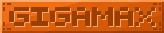

---
layout:
  title:
    visible: true
  description:
    visible: false
  tableOfContents:
    visible: true
  outline:
    visible: true
  pagination:
    visible: true
---

# ⚒️ Le Forgeron

### Description 📃


Dans PokeDonjon vous ferez affaire régulièrement avec le forgeron !\
En effet, ce grand gaillard est continuellement à la recherche d'équipement en tout genre et vous proposera des prix intéressants (PokeCoins ) en échange de vos pièces d'équipements ou bien de vos épées. 


<figure><figcaption>
Leon le Forgeron
</figcaption></figure>

### Améliorer le prix de revente 💹


Il y a plusieurs méthode pour augmenter le prix de revente de votre équipement auprès du Forgeron.\

* Proposer différents types de rareté .png>) -> .png>)\

* Augmenter votre [Rang d'Aventurier](../pokedonjon/les-rangs.md#les-rangs-de-base). \

* Profiter des avantages (boost de revente) des Rangs  /  / 


***

### Autre


A partir du rang  vous pourrez profiter de la commande <mark style="color:purple;">**`/forgeron`**</mark>\
\
Cette commande vous permet d'ouvrir le menu forgeron et de ventre vos items peut importe l'endroit ou vous êtes !\
\
Vous pouvez également profiter de la commande avec les rangs  ou 


***

### Historique 📖&#x20;

Cette page n'a reçu aucun correctif depuis sa sortie.
