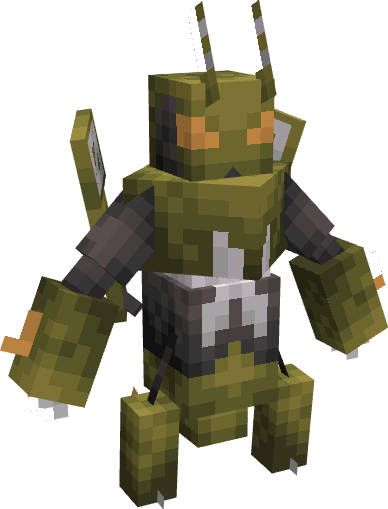

---
layout:
  title:
    visible: true
  description:
    visible: false
  tableOfContents:
    visible: true
  outline:
    visible: true
  pagination:
    visible: false
---

# Château de Mesaledo

### Description 📃


Le Château de Mesaledo sera la première zone que vous explorerez lors de votre aventure.\
\
Cette Région englobe le Château ainsi que toutes les plaines et les champs autour de ce dernier.\
\
C'est une région peu dangereuse, excellente pour débuter votre aventure !



Lors de votre première visite dans cette zone vous débloquerez cette émote : 


***

### Pokemon Sauvage


Vous pourrez trouver les Pokemon sauvages suivant : \

* Gambex  _(Seulement le jours entre x et x )_
* Gambex Shiny  _(Seulement le jours entre x et x )_&#x20;
* Lanssorien  _(Seulement la nuit entre x et x )_&#x20;
* Lanssorien Shiny _(Seulement la nuit entre x et x )_



Voici ce que ces Pokemon sauvages peuvent vous drop :&#x20;

\
Gambex  :

* 1-20 PokeCoins 
* PokÉpée .png>) / .png>) / .png>)

\
Gambex Shiny  :&#x20;

* 1-30 PokeCoins 
* PokÉpée  .png>) / .png>)
* Bonbon XP  \

Lanssorien  :&#x20;

* 1-20 PokeCoins 
* Potion de Soins 
* Potion de Mana 

\
Lanssorien Shiny :&#x20;

* 1-20 PokeCoins 
* Potion de Soins 
* Potion de Mana 
* Bonbon XP 


***

PNJ


Au spawn du Château de Mesaledo vous aurez la possibilité de retrouver tout les PNJ utiles.\
\
En explorant la zone vous pourrez également trouver ;\

* [Le Forgeron](../le-forgeron.md) 


***

### Historique 📖&#x20;

Cette page n'a reçu aucun correctif depuis sa sortie.
