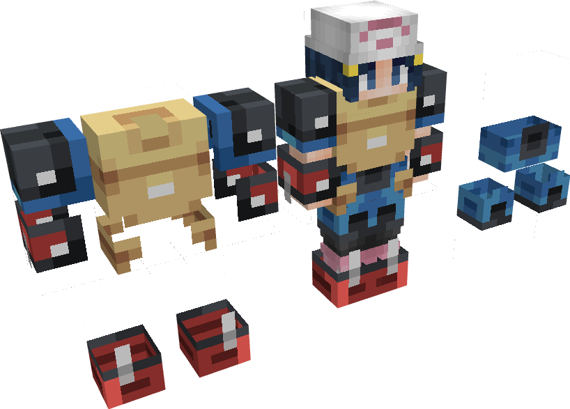

---
layout:
  title:
    visible: true
  description:
    visible: false
  tableOfContents:
    visible: true
  outline:
    visible: true
  pagination:
    visible: false
---

# Zone Rocheuse

### Description 📃


La région Zone rocheuse  se trouve au centre-est de la zone 1.\
\
Comme son nom l'indique c'est une zone avec beaucoup de pics de roche sortant du sol, cette région est très dangereuse, préparez vous bien avant de vous y aventurer !



Lors de votre première visite dans cette zone vous débloquerez cette émote : 


***

### Pokemon Sauvage


Vous pourrez trouver dans la Zone Rocheuse  les Pokemon sauvages suivants : \

* [Lucario ](../../pokemon/pokedex/lucario/)
* Strassie 



Voici ce que ces Pokemon sauvages peuvent vous drop :&#x20;

\
Lucario  :&#x20;

* 1-20 PokeCoins 
* [Armure de Lucario](../../equipement/armures/armure-de-lucario.md)  .png>)/ .png>)/ 
* [Griffe D'Aura](../../equipement/armes/griffe-daura.md)  .png>)/ .png>)/ 
* Clé Donjon Mega-Lucario 
* Œuf de Lucario 

\
Strassie  :&#x20;

* 1-50 PokeCoins 



***

PNJ


En explorant la Zone Rocheuse vous pourrez également trouver ;\

* [Le Forgeron](../le-forgeron.md) 
* Soigneur Odin (PNJ pour la quête de Lucario)


***

### Historique 📖&#x20;

Cette page n'a reçu aucun correctif depuis sa sortie.
