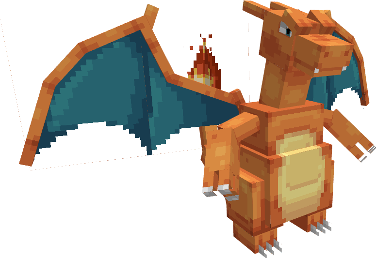
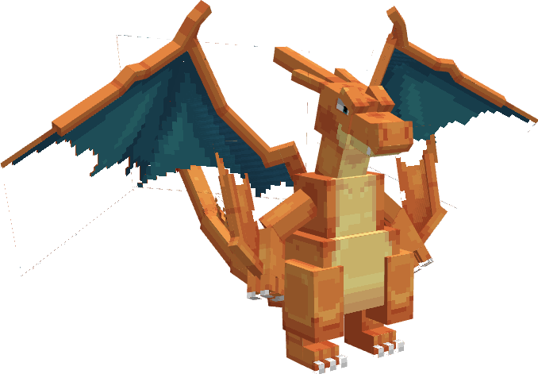
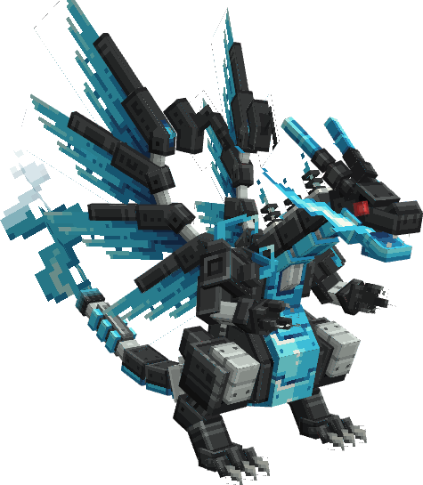
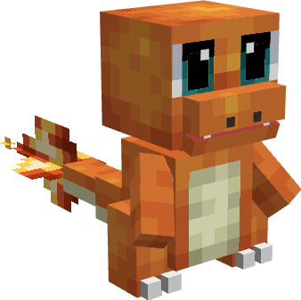
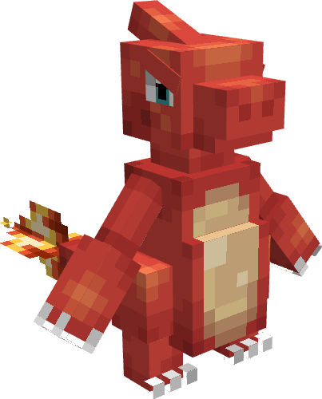

---
layout:
  title:
    visible: true
  description:
    visible: false
  tableOfContents:
    visible: true
  outline:
    visible: true
  pagination:
    visible: true
---

# Donjon Dracaufeu

<figure><figcaption></figcaption></figure>

### Description 📃


Le Donjon Dracaufeu  comporte 3 niveaux de difficulté.\
\
&#x20;                                                         <mark style="color:green;">Facile</mark> / <mark style="color:orange;">Moyen</mark> / <mark style="color:red;">Difficile</mark>\
\
Chaque niveau de difficulté possède un boss ainsi que des pokemon sauvages différents\
\
Le niveau <mark style="color:green;">Facile</mark> abrite : Un [Dracaufeu](../../pokemon/pokedex/salameche/a-1.md)  comme boss.\
\
Le niveau <mark style="color:orange;">Moyen</mark> abrite : Un [Mega-Dracaufeu](../../pokemon/pokedex/salameche/a-2.md)  comme boss.\
\
Le niveau <mark style="color:red;">Difficile</mark> abrite : Un Meca-Dracaufeu  comme boss.


***

### Donjon Dracaufeu  <mark style="color:green;">(Facile)</mark>

#### Comment y accéder ?


Afin d'accéder au Donjon Dracaufeu  <mark style="color:green;">(Facile)</mark>  vous devez simplement vous rendre dans la zone grâce à la commande <mark style="color:purple;">**`/donjon`**</mark>.\
\
Le Donjon facile est libre d'accès sans prérequis.


#### Les Pokemon Sauvages


Dans ce donjon vous pourrez trouver ces Pokemon :\

* [Salamèche ](../../pokemon/pokedex/salameche/)
* [Reptincel](../../pokemon/pokedex/salameche/a.md) &#x20;
* [Dracaufeu](../../pokemon/pokedex/salameche/a-1.md) (Boss) 


#### Le Boss du Donjon


Dans le Donjon Dracaufeu <mark style="color:green;">(Facile)</mark> vous allez combattre un [Dracaufeu](../../pokemon/pokedex/salameche/a-1.md)  comme boss.\
\
\
Point de Vie : 73.4 

Le Boss appellera en renfort des [Salamèche](../../pokemon/pokedex/salameche/)  et des [Reptincel](../../pokemon/pokedex/salameche/a.md)  durant son combat.


#### Les Récompenses du Donjon


Le Boss Dracaufeu   peut vous drop les items suivants : \
\
&#x20;Œuf de Salamèche \
Clé Donjon Mega-Dracaufeu \
Casque de Dracaufeu  

Pièce d'[Armure de Dracaufeu](../../equipement/armures/armure-de-dracaufeu.md)   .png>)&#x20;

&#x20;[Epée Draconique](../../equipement/armes/epee-draconique.md)    / .png>)


***

### Donjon Mega-Dracaufeu  <mark style="color:orange;">(Moyen)</mark>

#### Comment y accéder ?


Afin d'accéder au Donjon Mega-Dracaufeu  <mark style="color:orange;">(Moyen)</mark> vous devez simplement vous rendre dans la zone grâce à la commande <mark style="color:purple;">**`/donjon`**</mark> et posséder la PokeBall Mega-Dracaufeu \
\
Cette dernière est obtenable sur le Boss du Donjon Dracaufeu  <mark style="color:green;">(Facile).</mark>&#x20;


#### Les Pokemon Sauvages


Dans ce donjon vous pourrez trouver ces Pokemon :\

* [Salamèche ](../../pokemon/pokedex/salameche/)
* [Reptincel](../../pokemon/pokedex/salameche/a.md) &#x20;
* [Dracaufeu](../../pokemon/pokedex/salameche/a-1.md)
* [Mega-Dracaufeu](../../pokemon/pokedex/salameche/a-2.md)  (Boss)


#### Le Boss du Donjon


Dans le Donjon Mega-Dracaufeu  <mark style="color:orange;">(Moyen)</mark> vous allez combattre un [Mega-Dracaufeu](../../pokemon/pokedex/salameche/a-2.md)  comme boss.\
\
&#x20;                          \
Point de Vie : 420 

Le Boss appellera en renfort des [Reptincel](../../pokemon/pokedex/salameche/a.md)   durant son combat.


#### Les Récompenses du Donjon


Le Boss  [Mega-Dracaufeu](../../pokemon/pokedex/salameche/a-2.md)   peut vous drop les items suivants : \
\
Œuf de Salamèche \
Clé Donjon Meca-Dracaufeu \
Dracaufite

Pièce d'[Armure de Dracaufeu](../../equipement/armures/armure-de-dracaufeu.md)  .png>) / .png>)

&#x20;[Epée Draconique](../../equipement/armes/epee-draconique.md)   .png>) / .png>)


***

### Donjon Meca-Dracaufeu  <mark style="color:red;">(Difficile)</mark>

#### Comment y accéder ?


Afin d'accéder au Donjon Meca-Dracaufeu  <mark style="color:red;">(Difficile)</mark> vous devez simplement vous rendre dans la zone grâce à la commande <mark style="color:purple;">**`/donjon`**</mark> et posséder la PokeBall Meca-Dracaufeu \
\
Cette dernière est obtenable sur le Boss du Donjon Mega-Dracaufeu  <mark style="color:orange;">(Moyen).</mark>


#### Les Pokemon Sauvages


Dans ce donjon vous pourrez trouver ces Pokemon :

* [Salamèche ](../../pokemon/pokedex/salameche/)
* [Reptincel](../../pokemon/pokedex/salameche/a.md) &#x20;
* [Dracaufeu](../../pokemon/pokedex/salameche/a-1.md)
* [Mega-Dracaufeu](../../pokemon/pokedex/salameche/a-2.md) (Mini-Boss) &#x20;
* Meca-Dracaufeu (Boss)  


#### Le Boss du Donjon


Dans le Donjon Meca-Dracaufeu <mark style="color:red;">(Difficile)</mark> vous allez combattre un Meca-Dracaufeu  comme boss.\
\
                           \
Point de Vie : 640 

Le Boss appellera en renfort des [Reptincel](../../pokemon/pokedex/salameche/a.md)  durant son combat.\



#### Les Récompenses du Donjon


Le Boss Meca-Dracaufeu  peut vous drop les items suivants :  \
\
Œuf de Salamèche \
Clé Donjon Sulfura 

Pièce d'[Armure de Dracaufeu](../../equipement/armures/armure-de-dracaufeu.md)  .png>) / .png>)/.png>)&#x20;

&#x20;[Epée Draconique](../../equipement/armes/epee-draconique.md)  .png>) / .png>) / .png>)


***

### Historique 📖&#x20;

#### [Update 0.1](../../pokedonjon/mise-a-jours.md#samedi-6-juillet-2024-or-m.a.j.-0.1-maintenance)

> * Ajouts du casque de Dracaufeu  et de l'épée Draconique  au boss du donjon Facile
> * Ajout de la rareté .png>) pour les Pièces d'Armure de Dracaufeu et l'épée Draconique dans les donjons Moyen et Difficile
