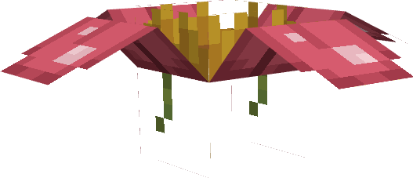

---
layout:
  title:
    visible: true
  description:
    visible: false
  tableOfContents:
    visible: true
  outline:
    visible: true
  pagination:
    visible: false
---

# Donjon Florizarre

<figure><figcaption></figcaption></figure>

### Description 📃


Le Donjon Florizarre  comporte 3 niveaux de difficulté.\
\
&#x20;                                                         <mark style="color:green;">Facile</mark> / <mark style="color:orange;">Moyen</mark> / <mark style="color:red;">Difficile</mark>\
\
Chaque niveau de difficulté possède un boss ainsi que des pokemon sauvages différents\
\
Le niveau <mark style="color:green;">Facile</mark> abrite : Un [Florizarre](../../pokemon/pokedex/bulbizarre/a-1.md)  comme boss\
\
Le niveau <mark style="color:orange;">Moyen</mark> abrite : Un [Mega-Florizarre](../../pokemon/pokedex/bulbizarre/a-2.md)  comme boss\
\
Le niveau <mark style="color:red;">Difficile</mark> abrite : Un Meca-Florizarre  comme boss


***

### Donjon Florizarre  <mark style="color:green;">(Facile)</mark>

#### Comment y accéder ?


Afin d'accéder au Donjon Florizarre  <mark style="color:green;">(Facile)</mark>  vous devez simplement vous rendre dans la zone grâce à la commande <mark style="color:purple;">**`/donjon`**</mark>.\
\
Le Donjon facile est libre d'accès sans prérequis.


#### Les Pokemon Sauvages


Dans ce donjon vous pourrez trouver ces Pokemon :

* [Bulbizarre ](../../pokemon/pokedex/bulbizarre/)
* [Herbizarre ](../../pokemon/pokedex/bulbizarre/a.md)
* [Florizarre ](../../pokemon/pokedex/bulbizarre/a-1.md)(Boss) &#x20;


#### Le Boss du Donjon


Dans le Donjon Florizarre  <mark style="color:green;">(Facile)</mark> vous allez combattre un [Florizarre](../../pokemon/pokedex/bulbizarre/a-1.md)  comme boss.\
\
\
Point de Vie : 97.9 

Le Boss appellera en renfort des [Bulbizarre](../../pokemon/pokedex/bulbizarre/)  et des [Herbizarre](../../pokemon/pokedex/bulbizarre/a.md)  durant son combat.


#### Les Récompenses du Donjon


Le Boss Florizarre peut vous drop les items suivants : \
\
Œuf de Bulbizarre \
Clé Donjon Mega-Florizarre \
Casque de Florizarre  

Pièce d'[Armure de Florizarre](../../equipement/armures/armure-de-florizarre.md)   .png>)&#x20;

[Sceptre Florazur](../../equipement/armes/sceptre-florazur.md)   / .png>)


***

### Donjon Mega-Florizarre  <mark style="color:orange;">(Moyen)</mark>

#### Comment y accéder ?


Afin d'accéder au Donjon Mega-Florizarre  <mark style="color:orange;">(Moyen)</mark> vous devez simplement vous rendre dans la zone grâce à la commande <mark style="color:purple;">**`/donjon`**</mark> et posséder la PokeBall Mega-Florizarre  \
\
Cette dernière est obtenable sur le Boss du Donjon Florizarre  <mark style="color:green;">(Facile).</mark>&#x20;


#### Les Pokemon Sauvages


Dans ce donjon vous pourrez trouver ces Pokemon :

* [Bulbizarre ](../../pokemon/pokedex/bulbizarre/)
* [Herbizarre ](../../pokemon/pokedex/bulbizarre/a.md)
* [Florizarre ](../../pokemon/pokedex/bulbizarre/a-1.md)&#x20;
* [Mega-Florizarre](../../pokemon/pokedex/bulbizarre/a-2.md) (Boss) 


#### Le Boss du Donjon


Dans le Donjon Mega-Florizarre  <mark style="color:orange;">(Moyen)</mark> vous allez combattre un [Mega-Florizarre](../../pokemon/pokedex/bulbizarre/a-2.md) comme boss.\
\
                           \
Point de Vie : 500 

Le Boss appellera en renfort des [Herbizarre](../../pokemon/pokedex/bulbizarre/a.md)  durant son combat.


#### Les Récompenses du Donjon


Le Boss Mega-Florizarre peut vous drop les items suivants : \
\
Œuf de Bulbizarre \
Clé Donjon Meca-Florizarre \
Florizarrite &#x20;

Pièce d'[Armure de Florizarre](../../equipement/armures/armure-de-florizarre.md)   .png>) / .png>)

[Sceptre Florazur](../../equipement/armes/sceptre-florazur.md)  .png>)  / .png>)


***

### Donjon Meca-Florizarre  <mark style="color:red;">(Difficile)</mark>

#### Comment y accéder ?


Afin d'accéder au Donjon Meca-Florizarre  <mark style="color:red;">(Difficile)</mark> vous devez simplement vous rendre dans la zone grâce à la commande <mark style="color:purple;">**`/donjon`**</mark> et posséder la PokeBall Meca-Florizarre \
\
Cette dernière est obtenable sur le Boss du Donjon Mega-Florizarre  <mark style="color:orange;">(Moyen).</mark>


#### Les Pokemon Sauvages


Dans ce donjon vous pourrez trouver ces Pokemon :

* [Bulbizarre ](../../pokemon/pokedex/bulbizarre/)
* [Herbizarre ](../../pokemon/pokedex/bulbizarre/a.md)
* [Florizarre ](../../pokemon/pokedex/bulbizarre/a-1.md)&#x20;
* [Mega-Florizarre](../../pokemon/pokedex/bulbizarre/a-2.md) (Mini-Boss) 
* Meca-Florizarre (Boss)  


#### Le Boss du Donjon


Dans le Donjon Meca-Florizarre  <mark style="color:red;">(Difficile)</mark> vous allez combattre un Meca-Florizarre comme boss.\
\
                           \
Point de Vie : 800 

Le Boss appellera en renfort des [Herbizarre](../../pokemon/pokedex/bulbizarre/a.md)  durant son combat.\
Le Boss pourra également se soigner et soigner les  [Herbizarre](../../pokemon/pokedex/bulbizarre/a.md)  à ses côtés.


#### Les Récompenses du Donjon


Le Boss Meca-Florizarre peut vous drop les items suivants :  \
\
Œuf de Bulbizarre \
Clé Donjon Electhor &#x20;

Pièce d'[Armure de Florizarre](../../equipement/armures/armure-de-florizarre.md)  .png>) / .png>) / .png>)

[Sceptre Florazur](../../equipement/armes/sceptre-florazur.md)  .png>) / .png>) / .png>)


***

### Historique 📖&#x20;

#### [Update 0.1](../../pokedonjon/mise-a-jours.md#samedi-6-juillet-2024-or-m.a.j.-0.1-maintenance)

> * Ajouts du casque de Florizarre  et du Sceptre Florazur  au boss du donjon Facile
> * Ajout de la rareté .png>) pour les Pièces d'Armure de Florizarre et Sceptre Florazur dans les donjons Moyen et Difficile
