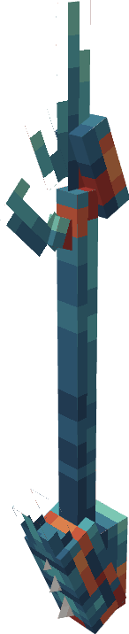

---
layout:
  title:
    visible: true
  description:
    visible: false
  tableOfContents:
    visible: true
  outline:
    visible: true
  pagination:
    visible: false
---

# Donjon Scarhino

<figure><figcaption></figcaption></figure>

### Description 📃


Le Donjon Scarhino  est un combat de boss au sein d'une arène\
\
Le Boss à vaincre sera un puissant [Mega-Scarhino](../../pokemon/pokedex/scarhino/a.md) 


***

### Donjon Mega-Scarhino 

#### Comment y accéder ?


Afin d'accéder au Donjon Mega-Scarhino  vous devez posséder la PokeBall Mega-Scarhino \
\
Cette dernière est obtenable sur les [Scarhino](../../pokemon/pokedex/scarhino/)  sauvages.



Afin de débloquer la zone du donjon vous devez également accomplir la quête du gardien.&#x20;


#### Les Pokemon Sauvages


Dans ce donjon vous pourrez trouver ces Pokemon : \

* [Scarhino](../../pokemon/pokedex/scarhino/) 
* [Mega-Scarhino](../../pokemon/pokedex/scarhino/)  (Boss)&#x20;


#### Le Boss du Donjon


Dans le Donjon Mega-Scarhino vous allez combattre un [Mega-Scarhino](../../pokemon/pokedex/scarhino/a.md)  comme boss.\
\
\
Point de Vie : 480 

Le Boss appellera en renfort des [Scarhino](../../pokemon/pokedex/scarhino/)   durant son combat.


#### Les Récompenses du Donjon


Le Boss Mega-Scarhino  peut vous drop les items suivants ; \
\
[Armure de Scarhino](../../equipement/armures/armure-de-scarhino.md) .png>)/ .png>) / .png>)\
[Epieu Scarabéique](../../equipement/armes/epieu-scarabique.md)  .png>) / .png>) / .png>)\
Scarhinoïte \
Œuf de Scarhino 


***

### Historique 📖&#x20;

#### [Update 0.1](../../pokedonjon/mise-a-jours.md#samedi-6-juillet-2024-or-m.a.j.-0.1-maintenance)

> &#x20;Ajout de la rareté .png>) pour l'Armure de Scarhino et L'épieu Scarabéique.
