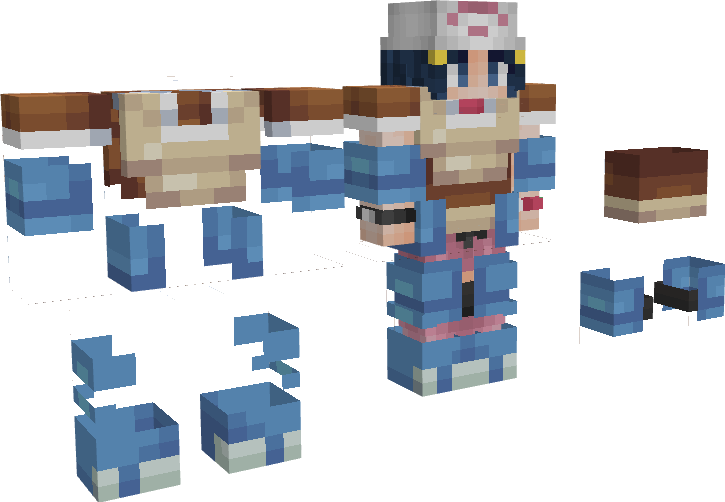

---
layout:
  title:
    visible: true
  description:
    visible: false
  tableOfContents:
    visible: true
  outline:
    visible: true
  pagination:
    visible: true
---

# Donjon Tortank

<figure><figcaption></figcaption></figure>

### Description 📃


Le Donjon Tortank  comporte 3 niveaux de difficulté.\
\
&#x20;                                                         <mark style="color:green;">Facile</mark> / <mark style="color:orange;">Moyen</mark> / <mark style="color:red;">Difficile</mark>\
\
Chaque niveau de difficulté possède un boss ainsi que des pokemon sauvages différents\
\
Le niveau <mark style="color:green;">Facile</mark> abrite : Un [Tortank](../../pokemon/pokedex/carapuce/a-1.md)  comme boss\
\
Le niveau <mark style="color:orange;">Moyen</mark> abrite : Un [Mega-Tortank](../../pokemon/pokedex/carapuce/a-2.md)  comme boss\
\
Le niveau <mark style="color:red;">Difficile</mark> abrite : Un Meca-Tortank  comme boss


***

### Donjon Tortank  <mark style="color:green;">(Facile)</mark>

#### Comment y accéder ?


Afin d'accéder au Donjon Tortank  <mark style="color:green;">(Facile)</mark>  vous devez simplement vous rendre dans la zone grâce à la commande <mark style="color:purple;">**`/donjon`**</mark>.\
\
Le Donjon facile est libre d'accès sans prérequis.


#### Les Pokemon Sauvages


Dans ce donjon vous pourrez trouver ces Pokemon :

* [Carapuce](../../pokemon/pokedex/carapuce/) 
* [Carabaffe](../../pokemon/pokedex/carapuce/a.md) 
* [Tortank](../../pokemon/pokedex/carapuce/a-1.md) (Boss) &#x20;


#### Le Boss du Donjon


Dans le Donjon Tortank  <mark style="color:green;">(Facile)</mark> vous allez combattre un [Tortank](../../pokemon/pokedex/carapuce/a-1.md)  comme boss.\
\
\
Point de Vie : 91.7 

Le Boss appellera en renfort des [Carapuce](../../pokemon/pokedex/carapuce/)  et des [Carabaffe](../../pokemon/pokedex/carapuce/a.md)  durant son combat.


#### Les Récompenses du Donjon


Le Boss Tortank  peut vous drop les items suivants : \
\
Œuf de Carapuce \
Clé Donjon Mega-Tortank \
Casque de Tortank  

Pièce d'[Armure de Tortank](../../equipement/armures/armure-de-tortank.md)   .png>)&#x20;

&#x20;L'[Hydro-Canon](../../equipement/armes/hydro-canon.md)    / .png>)


***

### Donjon Mega-Tortank  <mark style="color:orange;">(Moyen)</mark>

#### Comment y accéder ?


Afin d'accéder au Donjon Mega-Tortank  <mark style="color:orange;">(Moyen)</mark> vous devez simplement vous rendre dans la zone grâce à la commande <mark style="color:purple;">**`/donjon`**</mark> et posséder la PokeBall Mega-Tortank \
\
Cette dernière est obtenable sur le Boss du Donjon Tortank  <mark style="color:green;">(Facile).</mark>


#### Les Pokemon Sauvages


Dans ce donjon vous pourrez trouver ces Pokemon :

* [Carapuce](../../pokemon/pokedex/carapuce/) 
* [Carabaffe](../../pokemon/pokedex/carapuce/a.md) 
* [Tortank](../../pokemon/pokedex/carapuce/a-1.md) &#x20;
* [Mega-Tortank](../../pokemon/pokedex/carapuce/a-1.md) (Boss) 


#### Le Boss du Donjon


Dans le Donjon Mega-Tortank  <mark style="color:orange;">(Moyen)</mark> vous allez combattre un[ Mega-Tortank](../../pokemon/pokedex/carapuce/a-2.md)  comme boss.\
\
                          \
Point de Vie : 500 

Le Boss appellera en renfort des [Carabaffe](../../pokemon/pokedex/carapuce/a.md)  durant son combat.


#### Les Récompenses du Donjon


Le Boss Mega-Tortank  peut vous drop les items suivants : \
\
Œuf de Carapuce \
Clé Donjon Meca-Tortank \
Tortankite 

Pièce d'[Armure de Tortank](../../equipement/armures/armure-de-tortank.md)  .png>) / 

&#x20;L'[Hydro-Canon](../../equipement/armes/hydro-canon.md)  .png>) / .png>)&#x20;


***

### Donjon Meca-Tortank  <mark style="color:red;">(Difficile)</mark>

#### Comment y accéder ?


Afin d'accéder au Donjon Meca-Tortank  <mark style="color:red;">(Difficile)</mark> vous devez simplement vous rendre dans la zone grâce à la commande <mark style="color:purple;">**`/donjon`**</mark> et posséder la PokeBall Meca-Tortank \
\
Cette dernière est obtenable sur le Boss du Donjon Mega-Tortank  <mark style="color:orange;">(Moyen).</mark>


#### Les Pokemon Sauvages


Dans ce donjon vous pourrez trouver ces Pokemon :

* [Carapuce](../../pokemon/pokedex/carapuce/) 
* [Carabaffe](../../pokemon/pokedex/carapuce/a.md) 
* [Tortank](../../pokemon/pokedex/carapuce/a-1.md) &#x20;
* [Mega-Tortank](../../pokemon/pokedex/carapuce/a-1.md) (Mini-Boss) 
* Meca-Tortank (Boss) 


#### Le Boss du Donjon


Dans le Donjon Meca-Tortank  <mark style="color:red;">(Difficile)</mark> vous allez combattre un Meca-Tortank  comme boss.\
\
                           \
Point de Vie : 700 

Le Boss appellera en renfort des [Carabaffe](../../pokemon/pokedex/carapuce/a.md)  durant son combat.


#### Les Récompenses du Donjon


Le Boss Meca-Tortank  peut vous drop les items suivants :  \
\
Œuf de Carapuce \
Clé Donjon Artikodin 

Pièce d'[Armure de Tortank](../../equipement/armures/armure-de-tortank.md)  .png>) /  / .png>)

&#x20;L'[Hydro-Canon](../../equipement/armes/hydro-canon.md)  / .png>) / .png>)


***

### Historique 📖&#x20;

#### [Update 0.1](../../pokedonjon/mise-a-jours.md#samedi-6-juillet-2024-or-m.a.j.-0.1-maintenance)

> * Ajouts du casque de Tortank  et du Hydro-Canon  au boss du donjon Facile
> * Ajout de la rareté .png>) pour les Pièces d'Armure de Tortank et Hydro-Canon dans les donjons Moyen et Difficile

