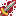

---
layout:
  title:
    visible: true
  description:
    visible: false
  tableOfContents:
    visible: true
  outline:
    visible: true
  pagination:
    visible: true
---

# ⛏️ Métiers

<figure><figcaption></figcaption></figure>

***

### Description 📃


Dans PokeDonjon vous aurez l'accès à 2 métiers.

* Chasseurs de Donjons
* Maître Explorateur

\
Afin de progresser dans votre métier vous devrez **récupérer de l'expérience en vainquant des Pokemon sauvages ou bien des boss de donjon**. \
\
Ces métiers sont définit par des niveaux, chaque niveau atteins vous offrira une récompense qui au fil des paliers deviendra de plus en plus généreuse.\
\
Pour débloquer l'accès au Métier Maître Explorateur vous devrez atteindre le niveau 50 en tant que Chasseur de Donjons.\
\
Vous pouvez également accéder aux menus des métiers grâce à la commande  : <mark style="color:purple;">**`/metiers`**</mark>


***

### Récompense de Niveau

<table data-card-size="large" data-view="cards" data-full-width="true"><thead><tr><th align="center"></th><th align="center"></th><th align="center"></th><th></th></tr></thead><tbody><tr><td align="center"><strong>Chasseur de Donjons</strong></td><td align="center"></td><td align="center"> <mark style="color:red;"><strong>Récompenses</strong></mark></td><td><mark style="color:blue;"><strong>Niveau 1 :</strong></mark> 50 PokeCoins  <mark style="color:blue;"><strong>Niveau 2 :</strong></mark> 2 Bonbons XP  <mark style="color:blue;"><strong>Niveau 3 :</strong></mark> x1 PikaBall  | PikaBox  <mark style="color:blue;"><strong>Niveau 4 :</strong></mark> 50 PokeCoins  <mark style="color:blue;"><strong>Niveau 5 :</strong></mark> 2 Bonbons XP  <mark style="color:blue;"><strong>Niveau 6 :</strong></mark> x1 Œuf Starter <em>(Aléatoire)</em> <mark style="color:blue;"><strong>Niveau 7 :</strong></mark> 50 PokeCoins  <mark style="color:blue;"><strong>Niveau 8 :</strong></mark>  2 Bonbons XP  <mark style="color:blue;"><strong>Niveau 9 :</strong></mark> x1 PikaBall  | PikaBox  <mark style="color:blue;"><strong>Niveau 10 :</strong></mark> 50 PokeCoins  <mark style="color:blue;"><strong>Niveau 11 :</strong></mark> Accès à l'émote  <mark style="color:blue;"><strong>Niveau 12 :</strong></mark> x1 Œuf Starter <em>(Aléatoire)</em> <mark style="color:blue;"><strong>Niveau 13 :</strong></mark> 100 PokeCoins  <mark style="color:blue;"><strong>Niveau 14 :</strong></mark> 3 Bonbons XP  <mark style="color:blue;"><strong>Niveau 15 :</strong></mark> x1 IronBall  | Box Paradox   <mark style="color:blue;"><strong>Niveau 16 :</strong></mark> 100 PokeCoins  <mark style="color:blue;"><strong>Niveau 17 :</strong></mark> 3 Bonbons XP  <mark style="color:blue;"><strong>Niveau 18 :</strong></mark> x1 Œuf Starter <em>(Aléatoire)</em> <mark style="color:blue;"><strong>Niveau 19 :</strong></mark> 100 PokeCoins  <mark style="color:blue;"><strong>Niveau 20 :</strong></mark> x1 Clé Méga Donjon  <em>(Aléatoire)</em> <mark style="color:blue;"><strong>Niveau 21 :</strong></mark> x1 Gemme <em>(Rareté Aléatoire)</em> <mark style="color:blue;"><strong>Niveau 22 :</strong></mark> 200 PokeCoins  <mark style="color:blue;"><strong>Niveau 23 :</strong></mark> x1 Nettoyeur de Gemme  <mark style="color:blue;"><strong>Niveau 24 :</strong></mark> x1 Œuf Méga  <em>(Aléatoire)</em> <mark style="color:blue;"><strong>Niveau 25 :</strong></mark> 200 PokeCoins  <mark style="color:blue;"><strong>Niveau 26 :</strong></mark> 5 Bonbons XP  <mark style="color:blue;"><strong>Niveau 27 :</strong></mark> x1 IronBall  | Box Paradox   <mark style="color:blue;"><strong>Niveau 28 :</strong></mark> 200 PokeCoins  <mark style="color:blue;"><strong>Niveau 29 :</strong></mark> Accès à l'émote  <mark style="color:blue;"><strong>Niveau 30 :</strong></mark> x1 Œuf Méga  <em>(Aléatoire)</em> <mark style="color:blue;"><strong>Niveau 31 :</strong></mark> 500 PokeCoins  <mark style="color:blue;"><strong>Niveau 32 :</strong></mark> x1 Clé Méga Donjon  <em>(Aléatoire)</em> <mark style="color:blue;"><strong>Niveau 33 :</strong></mark> x1 DracoBall  | Box Gigamax   <mark style="color:blue;"><strong>Niveau 34 :</strong></mark> 500 PokeCoins  <mark style="color:blue;"><strong>Niveau 35 :</strong></mark> x1 Nettoyeur de Skin  <mark style="color:blue;"><strong>Niveau 36 :</strong></mark> x1 Œuf Méga  <em>(Aléatoire)</em> <mark style="color:blue;"><strong>Niveau 37 :</strong></mark> 500 PokeCoins  <mark style="color:blue;"><strong>Niveau 38 :</strong></mark>  8 Bonbons XP  <mark style="color:blue;"><strong>Niveau 39 :</strong></mark> x1 Gemme Spéciale   <em>(Aléatoire)</em> <mark style="color:blue;"><strong>Niveau 40 :</strong></mark> 1000 PokeCoins  <mark style="color:blue;"><strong>Niveau 41 :</strong></mark> x1 Clé Donjon Méca  <em>(Aléatoire)</em> <mark style="color:blue;"><strong>Niveau 42 :</strong></mark> x3 PikaBalls  | PikaBox  <mark style="color:blue;"><strong>Niveau 43 :</strong></mark> 1000 PokeCoins  <mark style="color:blue;"><strong>Niveau 44 :</strong></mark> 10 Bonbons XP  <mark style="color:blue;"><strong>Niveau 45 :</strong></mark> x1 Clé Donjon Légendaire  <em>(Aléatoire)</em> <mark style="color:blue;"><strong>Niveau 46 :</strong></mark> 1000 PokeCoins  <mark style="color:blue;"><strong>Niveau 47 :</strong></mark> Accès à l'émote  <mark style="color:blue;"><strong>Niveau 48 :</strong></mark> 3 PokeBalls  | Vote  <mark style="color:blue;"><strong>Niveau 49 :</strong></mark> 2000 PokeCoins  <mark style="color:blue;"><strong>Niveau 50 :</strong></mark> x1 MewBall  | Caisse Fabuleux </td></tr><tr><td align="center"><strong>Maître Explorateur</strong></td><td align="center"></td><td align="center"> <mark style="color:red;"><strong>Récompenses</strong></mark></td><td><mark style="color:blue;"><strong>Niveau 1 :</strong></mark> 100 PokeCoins  <mark style="color:blue;"><strong>Niveau 2 :</strong></mark> 3 Bonbons XP  <mark style="color:blue;"><strong>Niveau 3 :</strong></mark> x1 PikaBall  | PikaBox  <mark style="color:blue;"><strong>Niveau 4 :</strong></mark> 100 PokeCoins  <mark style="color:blue;"><strong>Niveau 5 :</strong></mark> 3 Bonbons XP  <mark style="color:blue;"><strong>Niveau 6 :</strong></mark> x1 Œuf Starter <em>(Aléatoire)</em> <mark style="color:blue;"><strong>Niveau 7 :</strong></mark> 100 PokeCoins  <mark style="color:blue;"><strong>Niveau 8 :</strong></mark>  3 Bonbons XP  <mark style="color:blue;"><strong>Niveau 9 :</strong></mark> x1 PikaBall  | PikaBox  <mark style="color:blue;"><strong>Niveau 10 :</strong></mark> 100 PokeCoins  <mark style="color:blue;"><strong>Niveau 11 :</strong></mark> Accès à l'émote  <mark style="color:blue;"><strong>Niveau 12 :</strong></mark> x1 Œuf Starter <em>(Aléatoire)</em> <mark style="color:blue;"><strong>Niveau 13 :</strong></mark> 200 PokeCoins  <mark style="color:blue;"><strong>Niveau 14 :</strong></mark> 4 Bonbons XP  <mark style="color:blue;"><strong>Niveau 15 :</strong></mark> x1 IronBall  | Box Paradox   <mark style="color:blue;"><strong>Niveau 16 :</strong></mark> 200 PokeCoins  <mark style="color:blue;"><strong>Niveau 17 :</strong></mark> 4 Bonbons XP  <mark style="color:blue;"><strong>Niveau 18 :</strong></mark> x1 Œuf Starter <em>(Aléatoire)</em> <mark style="color:blue;"><strong>Niveau 19 :</strong></mark> 200 PokeCoins  <mark style="color:blue;"><strong>Niveau 20 :</strong></mark> x1 Clé Méga Donjon  <em>(Aléatoire)</em> <mark style="color:blue;"><strong>Niveau 21 :</strong></mark> x1 Gemme <em>(Rareté Aléatoire)</em> <mark style="color:blue;"><strong>Niveau 22 :</strong></mark> 400 PokeCoins  <mark style="color:blue;"><strong>Niveau 23 :</strong></mark> x1 Nettoyeur de Gemme  <mark style="color:blue;"><strong>Niveau 24 :</strong></mark> x1 Œuf Méga  <em>(Aléatoire)</em> <mark style="color:blue;"><strong>Niveau 25 :</strong></mark> 400 PokeCoins  <mark style="color:blue;"><strong>Niveau 26 :</strong></mark> 6 Bonbons XP  <mark style="color:blue;"><strong>Niveau 27 :</strong></mark> x1 IronBall  | Box Paradox  <mark style="color:blue;"><strong>Niveau 28 :</strong></mark> 400 PokeCoins  <mark style="color:blue;"><strong>Niveau 29 :</strong></mark> Accès à l'émote  <mark style="color:blue;"><strong>Niveau 30 :</strong></mark> x1 Œuf Méga  <em>(Aléatoire)</em> <mark style="color:blue;"><strong>Niveau 31 :</strong></mark> 1000 PokeCoins  <mark style="color:blue;"><strong>Niveau 32 :</strong></mark> x1 Clé Méga Donjon  <em>(Aléatoire)</em> <mark style="color:blue;"><strong>Niveau 33 :</strong></mark> x1 DracoBall  | Box Gigamax   <mark style="color:blue;"><strong>Niveau 34 :</strong></mark> 1000 PokeCoins  <mark style="color:blue;"><strong>Niveau 35 :</strong></mark> x1 Nettoyeur de Skin  <mark style="color:blue;"><strong>Niveau 36 :</strong></mark> x1 Œuf Méga  <em>(Aléatoire)</em> <mark style="color:blue;"><strong>Niveau 37 :</strong></mark> 1000 PokeCoins  <mark style="color:blue;"><strong>Niveau 38 :</strong></mark>  10 Bonbons XP  <mark style="color:blue;"><strong>Niveau 39 :</strong></mark> x1 Gemme Spéciale   <em>(Aléatoire)</em> <mark style="color:blue;"><strong>Niveau 40 :</strong></mark> 2000 PokeCoins  <mark style="color:blue;"><strong>Niveau 41 :</strong></mark> x1 Clé Donjon Méca  <em>(Aléatoire)</em> <mark style="color:blue;"><strong>Niveau 42 :</strong></mark> x3 PikaBalls  | PikaBox  <mark style="color:blue;"><strong>Niveau 43 :</strong></mark> 2000 PokeCoins  <mark style="color:blue;"><strong>Niveau 44 :</strong></mark> 10 Bonbons XP  <mark style="color:blue;"><strong>Niveau 45 :</strong></mark> x1 Clé Donjon Légendaire  <em>(Aléatoire)</em> <mark style="color:blue;"><strong>Niveau 46 :</strong></mark> 1000 PokeCoins  <mark style="color:blue;"><strong>Niveau 47 :</strong></mark> Accès à l'émote  <mark style="color:blue;"><strong>Niveau 48 :</strong></mark> 3 PokeBalls  | Vote  <mark style="color:blue;"><strong>Niveau 49 :</strong></mark> 4000 PokeCoins  <mark style="color:blue;"><strong>Niveau 50 :</strong></mark> x1 MewBall  | Caisse Fabuleux </td></tr></tbody></table>

***

### Historique 📖&#x20;

Cette page n'a reçu aucun correctif depuis sa sortie.
