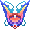

---
layout:
  title:
    visible: true
  description:
    visible: false
  tableOfContents:
    visible: true
  outline:
    visible: true
  pagination:
    visible: true
---

# ⚜️ Les Rangs

### Les Rangs dans PokeDonjon


Au sein de PokeDonjon vous pourrez retrouver 2 catégories de rangs;

* [Les Rangs de base](les-rangs.md#les-rangs-de-base) (Obtenable en jouant avec les PokeCoins )&#x20;
* [Les Rangs Boutique](les-rangs.md#les-rangs-boutique) (Obtenable sur la boutique)

Ces 2 catégories de grade **sont cumulables**, vous pouvez donc obtenir un rangs achetable sur la boutique et obtenir les rangs en jeu grâce aux PokeCoins .&#x20;


***

### Les Rangs de Base          &#x20;


Vous commencerez votre aventure avec le rang Débutant , ce dernier ne vous apporte aucun avantage spécifique. \
\
Vous pourrez gravir les échelons en achetant les rangs ci-dessous en jeu et obtenir de nombreux avantages !\
\
Pour obtenir un nouveau rang il vous suffit d'obtenir le prix nécessaire en PokeCoins et d'ensuite effectuer la commande<mark style="color:purple;">**`/rang`**</mark>ensuite vous devrez passer votre curseur sur le rang désiré.


<table data-card-size="large" data-view="cards" data-full-width="true"><thead><tr><th align="center"></th><th align="center"></th><th align="center"></th><th></th><th align="center"></th><th></th><th align="center"></th><th></th><th align="center"></th><th></th><th align="center"></th><th align="center"></th></tr></thead><tbody><tr><td align="center"><strong>Rang Novice</strong> </td><td align="center"></td><td align="center"> <mark style="color:red;"><strong>Avantages</strong></mark></td><td><ul><li>Accès <mark style="color:orange;">3</mark> Homes (Permet de définir un point de téléportation)</li><li>Accès au <mark style="color:orange;">/tpa</mark> (téléportation vers un joueur)</li><li>Boost de <mark style="color:orange;">10%</mark> à la revente du <a href="../fonctionnement-du-serveur/le-forgeron.md">Forgeron</a> </li><li>Limite de <mark style="color:orange;">2</mark> items en vente à l'<a href="../fonctionnement-du-serveur/hotel-des-ventes.md">HDV</a></li><li>Temps maximum d'une vente à l'<a href="../fonctionnement-du-serveur/hotel-des-ventes.md">HDV</a> -> <mark style="color:orange;">2 heures</mark></li><li>Emote Clé de Voûte </li></ul></td><td align="center"> <mark style="color:red;"><strong>Accès au /kit Novice</strong></mark></td><td><ul><li>x10 Potions de Soins </li><li>x10 Potions de Mana </li></ul>
                      <em>Cooldown = 7 Jours</em>
</td><td align="center"></td><td></td><td align="center"><mark style="color:red;"><strong>Bonus (A l'achat)</strong></mark></td><td><ul><li>x1 IronBall  | Box Paradox </li><li>x1 PikaBall  | PikaBox </li><li>x1 Œuf Starter <em>(Aléatoire)</em></li><li>x8 Bonbons XP </li></ul></td><td align="center"> <mark style="color:red;"><strong>Prix</strong></mark></td><td align="center"><strong>-> 7.500 PokeCoins</strong> </td></tr><tr><td align="center"><strong>Rang Confirmé</strong> </td><td align="center"></td><td align="center"> <mark style="color:red;"><strong>Avantages</strong></mark></td><td><ul><li>Accès <mark style="color:orange;">5</mark> Homes (Permet de définir un point de téléportation)</li><li>Boost de <mark style="color:orange;">30%</mark> à la revente du <a href="../fonctionnement-du-serveur/le-forgeron.md">Forgeron</a> </li><li>Limite de <mark style="color:orange;">3</mark> items en vente à l'<a href="../fonctionnement-du-serveur/hotel-des-ventes.md">HDV</a></li><li>Temps maximum d'une vente à l'<a href="../fonctionnement-du-serveur/hotel-des-ventes.md">HDV</a> -> <mark style="color:orange;">4 heures</mark></li><li>Emote Pilule Talent </li></ul></td><td align="center"> <mark style="color:red;"><strong>Accès au /kit Confirme</strong></mark></td><td><ul><li>x8 Bonbons XP </li><li>x1 Œuf de Starter <em>(Aléatoire)</em></li></ul>
                      <em>Cooldown = 7 Jours</em>
</td><td align="center"></td><td></td><td align="center"><mark style="color:red;"><strong>Bonus (A l'achat)</strong></mark></td><td><ul><li>x1 IronBall  | Box Paradox </li><li>x3 PikaBalls  | PikaBox </li><li>x3 Œuf Starters  <em>(Aléatoire)</em></li><li>x1 Œuf de Méga  <em>(Aléatoire)</em></li><li>x16 Bonbons XP </li></ul></td><td align="center"> <mark style="color:red;"><strong>Prix</strong></mark></td><td align="center"><strong>-> 25.000 PokeCoins</strong> </td></tr><tr><td align="center"><strong>Rang Prodige</strong> </td><td align="center"></td><td align="center"> <mark style="color:red;"><strong>Avantages</strong></mark></td><td><ul><li>Accès <mark style="color:orange;">7</mark> Homes (Permet de définir un point de téléportation)</li><li>Accès au <mark style="color:orange;">/tpahere</mark> (téléportation d'un joueur vers un soi-même)</li><li>Boost de <mark style="color:orange;">50%</mark> à la revente du <a href="../fonctionnement-du-serveur/le-forgeron.md">Forgeron</a> </li><li>Limite de <mark style="color:orange;">4</mark> items en vente à l'<a href="../fonctionnement-du-serveur/hotel-des-ventes.md">HDV</a></li><li>Temps maximum d'une vente à l'<a href="../fonctionnement-du-serveur/hotel-des-ventes.md">HDV</a> ->  <mark style="color:orange;">8 heures</mark></li><li>Emote <mark style="color:orange;">Casque Brut</mark> </li></ul></td><td align="center"> <mark style="color:red;"><strong>Accès au /kit Prodige</strong></mark></td><td><ul><li>x1 Nettoyeur de Gemme </li><li>x1 Œuf de Méga  <em>(Aléatoire)</em></li></ul>
                      <em>Cooldown = 7 Jours</em>
</td><td align="center"></td><td></td><td align="center"><mark style="color:red;"><strong>Bonus (A l'achat)</strong></mark></td><td><ul><li>x1 DracoBall  | Box Gigamax </li><li>x2 IronBalls  | Box Paradox </li><li>x3 PikaBalls  | PikaBox </li><li>x3 Œufs Starter  <em>(Aléatoire)</em></li><li>x3 Œufs Méga  <em>(Aléatoire)</em></li><li>x32 Bonbons XP </li></ul></td><td align="center"> <mark style="color:red;"><strong>Prix</strong></mark></td><td align="center"><strong>-> 100.000 PokeCoins</strong> </td></tr><tr><td align="center"><strong>Rang Spécialiste</strong> </td><td align="center"></td><td align="center"> <mark style="color:red;"><strong>Avantages</strong></mark></td><td><ul><li>Accès <mark style="color:orange;">10</mark> Homes (Permet de définir un point de téléportation)</li><li>Boost de <mark style="color:orange;">70%</mark> à la revente du <a href="../fonctionnement-du-serveur/le-forgeron.md">Forgeron</a> </li><li>Limite de <mark style="color:orange;">6</mark> items en vente à l'<a href="../fonctionnement-du-serveur/hotel-des-ventes.md">HDV</a></li><li>Temps maximum d'une vente à l'<a href="../fonctionnement-du-serveur/hotel-des-ventes.md">HDV</a> -> <mark style="color:orange;">12 heures</mark></li><li>Emote <mark style="color:orange;">Garde-Talent</mark> </li></ul></td><td align="center"> <mark style="color:red;"><strong>Accès au /kit Spécialiste</strong></mark></td><td><ul><li>x1 Nettoyeur de Skin </li><li>x1 PikaBall  | PikaBox </li></ul>
                      <em>Cooldown = 7 Jours</em>
</td><td align="center"></td><td></td><td align="center"><mark style="color:red;"><strong>Bonus (A l'achat)</strong></mark></td><td><ul><li>x2 DracoBalls  | Box Gigamax </li><li>x2 IronBalls  | Box Paradox </li><li>x5 PikaBalls  | PikaBox </li><li>x5 Œufs Starter  <em>(Aléatoire)</em></li><li>x3 Œufs Méga  <em>(Aléatoire)</em></li><li>x1 Arme   <em>(Aléatoire)</em></li></ul>

</td><td align="center"> <mark style="color:red;"><strong>Prix</strong></mark></td><td align="center"><strong>-> 500.000 PokeCoins</strong> </td></tr><tr><td align="center"><strong>Rang Expert</strong> </td><td align="center"></td><td align="center"> <mark style="color:red;"><strong>Avantages</strong></mark></td><td><ul><li>Accès <mark style="color:orange;">12</mark> Homes (Permet de définir un point de téléportation)</li><li>Boost de <mark style="color:orange;">80%</mark> à la revente du <a href="../fonctionnement-du-serveur/le-forgeron.md">Forgeron</a> </li><li>Accès au <mark style="color:orange;">/forgeron</mark> (Permet d'ouvrir le menu forgeron)</li><li>Limite de <mark style="color:orange;">8</mark> items en vente à l'<a href="../fonctionnement-du-serveur/hotel-des-ventes.md">HDV</a></li><li>Temps maximum d'une vente à l'<a href="../fonctionnement-du-serveur/hotel-des-ventes.md">HDV</a> -> <mark style="color:orange;">16 heures</mark></li><li>Emote <mark style="color:orange;">Parc Ball</mark> </li></ul></td><td align="center"> <mark style="color:red;"><strong>Accès au /kit Expert</strong></mark></td><td><ul><li>x1 Clé Méga Donjon  <em>(Aléatoire)</em></li><li>x3 Œufs de Starter  <em>(Aléatoire)</em></li></ul>
                      <em>Cooldown = 7 Jours</em>
</td><td align="center"> <mark style="color:red;"><strong>Accès au /kit ExpertMois</strong></mark></td><td><ul><li>x1 DracoBalls  | Box Gigamax </li><li>x3 PikaBalls  | PikaBox </li></ul>
                      <em>Cooldown = 30 Jours</em>
</td><td align="center"> <mark style="color:red;"><strong>Bonus (A l'achat)</strong></mark></td><td><ul><li>x1 MewBall  | Box Fabuleux </li><li>x2 DracoBalls  | Box Gigamax </li><li>x2 IronBalls  | Box Paradox </li><li>x6 PikaBalls  | PikaBox </li><li>x5 Œufs Starter  <em>(Aléatoire)</em></li><li>x3 Œufs Méga  <em>(Aléatoire)</em></li><li>x1 Gemme Spéciale  <em>(Aléatoire)</em></li></ul></td><td align="center"> <mark style="color:red;"><strong>Prix</strong></mark></td><td align="center"><strong>-> 750.000 PokeCoins</strong> </td></tr><tr><td align="center"><strong>Rang Maitre</strong> </td><td align="center"></td><td align="center"> <mark style="color:red;"><strong>Avantages</strong></mark></td><td><ul><li>Accès 15 Homes (Permet de définir un point de téléportation)</li><li>Boost de <mark style="color:orange;">100%</mark> à la revente du <a href="../fonctionnement-du-serveur/le-forgeron.md">Forgeron</a> </li><li>Limite de <mark style="color:orange;">10</mark> items en vente à l'<a href="../fonctionnement-du-serveur/hotel-des-ventes.md">HDV</a></li><li>Temps maximum d'une vente à l'<a href="../fonctionnement-du-serveur/hotel-des-ventes.md">HDV</a> -> <mark style="color:orange;">24 heures</mark></li><li>Emote <mark style="color:orange;">Patch Talent</mark> </li></ul></td><td align="center"> <mark style="color:red;"><strong>Accès au /kit Maitre</strong></mark></td><td><ul><li>x1 Clé Donjon Légendaire  <em>(Aléatoire)</em></li><li>x3 Œufs Méga  <em>(Aléatoire)</em></li></ul>
                      <em>Cooldown = 7 Jours</em>
</td><td align="center"> <mark style="color:red;"><strong>Accès au /kit MaitreMois</strong></mark></td><td><ul><li>x1 MewBall  | Caisse Fabuleux </li><li>x3 PikaBalls  | PikaBox </li></ul>
                      <em>Cooldown = 30 Jours</em>
</td><td align="center"> <mark style="color:red;"><strong>Bonus (A l'achat)</strong></mark></td><td><ul><li>x2 MewBalls  | Box Fabuleux </li><li>x2 DracoBalls  | Box Gigamax </li><li>x2 IronBalls  | Box Paradox </li><li>x8 PikaBalls  | PikaBox </li><li>x5 Œufs Starter  <em>(Aléatoire)</em></li><li>x3 Œufs Méga  <em>(Aléatoire)</em></li><li>x1 Œuf Légendaire  <em>(Aléatoire)</em></li><li>x1 Gemme Spéciale  <em>(Aléatoire)</em></li><li>x1 Gemme Mythique  <em>(Aléatoire)</em></li></ul></td><td align="center"> <mark style="color:red;"><strong>Prix</strong></mark></td><td align="center"><strong>-> 3.000.000 PokeCoins</strong> </td></tr></tbody></table>

***

### Les Rangs Boutique


Les rangs obtenables sur la boutique sont les suivants ;

&#x20; /  / .png>)

\
C'est 3 rangs vous apporterons des avantages en jeu et surtout permettre de soutenir le serveur. \
\
Pour obtenir l'un de ces rangs : [**https://store.pokedonjon.fr/**](https://store.pokedonjon.fr/)


<table data-card-size="large" data-view="cards" data-full-width="true"><thead><tr><th align="center"></th><th align="center"></th><th align="center"></th><th></th><th align="center"></th><th></th><th align="center"></th><th></th><th align="center"></th><th></th><th align="center"></th><th align="center"></th></tr></thead><tbody><tr><td align="center"><strong>Rang Paradox</strong> </td><td align="center"></td><td align="center"><mark style="color:red;"><strong>Avantages</strong></mark></td><td><ul><li>Accès <mark style="color:orange;">5</mark> Homes (Permet de définir un point de téléportation)</li><li>Boost de <mark style="color:orange;">50%</mark> à la revente du <a href="../fonctionnement-du-serveur/le-forgeron.md">Forgeron</a> </li><li>Limite de <mark style="color:orange;">5</mark> items en vente à l'<a href="../fonctionnement-du-serveur/hotel-des-ventes.md">HDV</a></li><li>Temps maximum d'une vente à l'<a href="../fonctionnement-du-serveur/hotel-des-ventes.md">HDV</a> -> <mark style="color:orange;">10 heures</mark></li></ul></td><td align="center"><mark style="color:red;"><strong>Accès au /kit Paradox</strong></mark></td><td><ul><li>x1 IronBalls  | Box Paradox </li><li>x1 Clé Méga Donjon  <em>(Aléatoire)</em></li></ul></td><td align="center"><mark style="color:red;"><strong>Accès au /kit ParadoxMois</strong></mark></td><td><ul><li>x3 IronBalls  | Box Paradox </li><li>x1 Clé Donjon Légendaire  <em>(Aléatoire)</em></li></ul></td><td align="center"><mark style="color:red;"><strong>Bonus (A l'achat)</strong></mark></td><td><ul><li>x3 IronBalls  | Box Paradox </li><li>x3 PikaBalls  | PikaBox </li><li>x3 Œufs Starter  <em>(Aléatoire)</em></li><li>x1 Arme   (Au choix)</li><li>x1 Casque   (Au choix)</li></ul></td><td align="center"><mark style="color:red;"><strong>Obtenir le Rang Paradox</strong></mark> </td><td align="center"><strong>-></strong> <a href="https://store.pokedonjon.fr/"><strong>https://store.pokedonjon.fr/</strong></a></td></tr><tr><td align="center"><strong>Rang Gigamax</strong> </td><td align="center"></td><td align="center"><mark style="color:red;"><strong>Avantages</strong></mark></td><td><ul><li>Accès <mark style="color:orange;">12</mark> Homes (Permet de définir un point de téléportation)</li><li>Boost de <mark style="color:orange;">100%</mark> à la revente du <a href="../fonctionnement-du-serveur/le-forgeron.md">Forgeron</a> </li><li>Limite de <mark style="color:orange;">8</mark> items en vente à l'<a href="../fonctionnement-du-serveur/hotel-des-ventes.md">HDV</a></li><li>Temps maximum d'une vente à l'<a href="../fonctionnement-du-serveur/hotel-des-ventes.md">HDV</a> -> <mark style="color:orange;">24 heures</mark></li><li>Accès <mark style="color:orange;">/nick</mark> (Permet d'avoir un surnom en jeu sans couleur)</li><li>Accès au <mark style="color:orange;">/forgeron</mark> (Permet d'ouvrir le menu forgeron)</li></ul></td><td align="center"><mark style="color:red;"><strong>Accès au /kit Gigamax</strong></mark></td><td><ul><li>x1 DracoBalls  | Box Gigamax </li><li>x1 Clé Donjon Méca  <em>(Aléatoire)</em></li></ul></td><td align="center"><mark style="color:red;"><strong>Accès au /kit GigamaxMois</strong></mark></td><td><ul><li>x3 DracoBalls  | Box Gigamax </li><li>x1 Clé Donjon Légendaire  <em>(Aléatoire)</em></li></ul></td><td align="center"><mark style="color:red;"><strong>Bonus (A l'achat)</strong></mark></td><td><ul><li>x2 DracoBalls  | Box Gigamax </li><li>x6 PikaBalls  | PikaBox </li><li>x3 Œufs Méga  <em>(Aléatoire)</em></li><li>x1 Arme   (Au choix)</li><li>x1 Armure complète   (Au choix)</li></ul></td><td align="center"><mark style="color:red;"><strong>Obtenir le Rang Gigamax</strong></mark> </td><td align="center"><strong>-></strong> <a href="https://store.pokedonjon.fr/"><strong>https://store.pokedonjon.fr/</strong></a></td></tr><tr><td align="center"><strong>Rang Fabuleux</strong> </td><td align="center"></td><td align="center"><mark style="color:red;"><strong>Avantages</strong></mark></td><td><ul><li>Accès <mark style="color:orange;">Illimité</mark> Homes (Permet de définir un point de téléportation)</li><li>Boost de <mark style="color:orange;">200%</mark> à la revente du <a href="../fonctionnement-du-serveur/le-forgeron.md">Forgeron</a> </li><li>Limite de <mark style="color:orange;">12</mark> items en vente à l'<a href="../fonctionnement-du-serveur/hotel-des-ventes.md">HDV</a></li><li>Temps maximum d'une vente à l'<a href="../fonctionnement-du-serveur/hotel-des-ventes.md">HDV</a> -> <mark style="color:orange;">36 heures</mark></li><li>Accès <mark style="color:orange;">/nick</mark> (Permet d'avoir un surnom en jeu <mark style="color:orange;">avec</mark> couleur)</li><li>Accès au <mark style="color:orange;">/forgeron</mark> (Permet d'ouvrir le menu forgeron)</li></ul>

</td><td align="center"><mark style="color:red;"><strong>Accès au /kit Fabuleux</strong></mark></td><td><ul><li>x1 MewBall  | Caisse Fabuleux</li><li>x1 Clé Donjon Légendaire  <em>(Aléatoire)</em></li></ul></td><td align="center"><mark style="color:red;"><strong>Accès au /kit FabuleuxMois</strong></mark></td><td><ul><li>x3 MewBalls  | Box Fabuleux</li><li>x1 Œuf Légendaire  <em>(Aléatoire)</em></li></ul></td><td align="center"><mark style="color:red;"><strong>Bonus (A l'achat)</strong></mark></td><td><ul><li>x3 MewBall  | Box Fabuleux </li><li>x12 PikaBalls  | PikaBox </li><li>x3 Œufs Starter  <em>(Aléatoire)</em></li><li>x3 Œufs Méga  <em>(Aléatoire)</em></li><li>x1 Gemme Spéciale Arme / Amure  <em>(Au choix)</em></li><li>x1 Gemme Mythique  <em>(Aléatoire)</em></li><li>x1 Arme   <em>(Au choix)</em></li><li>x1 Armure complète   (Au choix)</li></ul></td><td align="center"><mark style="color:red;"><strong>Obtenir le Rang Fabuleux</strong></mark> </td><td align="center"><strong>-></strong> <a href="https://store.pokedonjon.fr/"><strong>https://store.pokedonjon.fr/</strong></a></td></tr><tr><td align="center"></td><td align="center"></td><td align="center"></td><td></td><td align="center"></td><td></td><td align="center"></td><td></td><td align="center"></td><td></td><td align="center"></td><td align="center"></td></tr></tbody></table>


Chaque rang est individuel, c'est à dire qu'acheter le rang  ne vous donne pas l'accès aux kits ou aux avantages des rangs  ou  !\
\
Si vous avez acheté 2 rangs sur la Boutique, les avantages (Homes, Boost Forgeron, HDV,..) seront définis en fonction de votre rang le plus haut.\
\
&#xNAN;_&#x43;eci n'est pas valable pour les **rangs de base**, vous pouvez cumuler les avantages de ces derniers_


***

### Historique 📖

Cette page n'a reçu aucun correctif depuis sa sortie.
