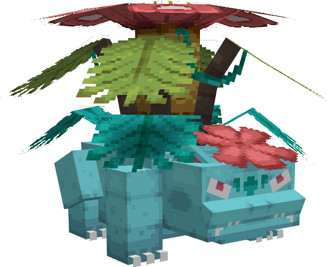
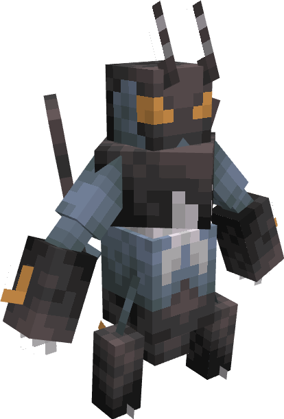
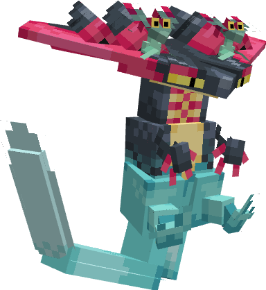
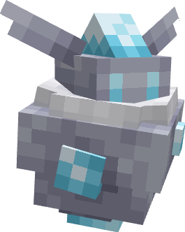

---
layout:
  title:
    visible: true
  description:
    visible: false
  tableOfContents:
    visible: true
  outline:
    visible: true
  pagination:
    visible: false
---

# 🇲🇨 Pokedex

### Description 📃


Dans PokeDonjon vous trouverez 2 catégories de pokemons ;\
\
<mark style="color:yellow;">**Les sauvages**</mark> <mark style="color:yellow;"></mark><mark style="color:yellow;">:</mark> sont ceux que vous rencontrerez dans les [Donjons ](../../fonctionnement-du-serveur/les-donjons/)ou bien dans le [Monde Aventure](../../fonctionnement-du-serveur/le-monde-aventure/).\
\
<mark style="color:yellow;">**Les compagnons**</mark> <mark style="color:yellow;"></mark><mark style="color:yellow;">:</mark> sont ceux qui combattrons à vos côtés.

\
Ces derniers seront obtenables grâces à des quêtes ou bien en obtenant leurs oeufs.&#x20;


***

### Fonctionnement des Pokemons ❔


Les Pokemon sauvages ont leurs propres intelligence, ils attaqueront donc par eux-mêmes vos Pokemons ou vous si vous êtes dans leurs portées.\
\
Vos Compagnons pourront être invoqué grâce au Pokedex (Item permanent dans votre 9ème place de votre inventaire) ou avec la commande <mark style="color:purple;">`/pokedex`</mark>`.`\
\
Ils combattront à vos côtés tout les ennemies hostiles à proximité.\
\
Ils ont un système de niveau allant de 1 à 20, chaque niveau augmente ses statistiques de point de vie ainsi que de dégâts. \
\
A partir du niveau 20 si le Pokemon à une évolution il sera en mesure d'évoluer par lui-même ou grâce à l'objet requis.&#x20;


***

### **Listes des Pokemons**

<table><thead><tr><th width="493" align="center">Pokemon</th><th width="109" data-type="checkbox">Sauvage</th><th data-type="checkbox">Compagnon</th></tr></thead><tbody><tr><td align="center"><a href="bulbizarre/">Bulbizarre </a></td><td>true</td><td>true</td></tr><tr><td align="center"><a href="bulbizarre/a.md">Herbizarre </a></td><td>true</td><td>true</td></tr><tr><td align="center"><a href="bulbizarre/a-1.md">Florizarre</a></td><td>true</td><td>true</td></tr><tr><td align="center">Mega-Florizarre </td><td>true</td><td>true</td></tr><tr><td align="center">Mecha-Florizarre </td><td>true</td><td>false</td></tr><tr><td align="center"><a href="carapuce/">Carapuce </a></td><td>true</td><td>true</td></tr><tr><td align="center"><a href="carapuce/a.md">Carabaffe </a></td><td>true</td><td>true</td></tr><tr><td align="center"><a href="carapuce/a-1.md">Tortank </a></td><td>true</td><td>true</td></tr><tr><td align="center">Mega-Tortank </td><td>true</td><td>true</td></tr><tr><td align="center">Mecha-Tortank </td><td>true</td><td>false</td></tr><tr><td align="center"><a href="salameche/">Salamèche </a></td><td>true</td><td>true</td></tr><tr><td align="center"><a href="salameche/a.md">Reptincel</a> </td><td>true</td><td>true</td></tr><tr><td align="center"><a href="salameche/a-1.md">Dracaufeu</a> </td><td>true</td><td>true</td></tr><tr><td align="center">Mega-Dracaufeu Y </td><td>true</td><td>true</td></tr><tr><td align="center">Mecha-Dracaufeu </td><td>true</td><td>false</td></tr><tr><td align="center"><a href="steelix/">Steelix</a> </td><td>true</td><td>true</td></tr><tr><td align="center"><a href="steelix/a.md">Mega-Steelix</a> </td><td>true</td><td>true</td></tr><tr><td align="center"><a href="scarhino/">Scarhino</a> </td><td>true</td><td>true</td></tr><tr><td align="center"><a href="scarhino/a.md">Mega-Scarhino</a> </td><td>true</td><td>true</td></tr><tr><td align="center"><a href="lucario/">Lucario</a> </td><td>true</td><td>true</td></tr><tr><td align="center"><a href="lucario/a.md">Mega-Lucario </a></td><td>true</td><td>true</td></tr><tr><td align="center">Gambex </td><td>true</td><td>false</td></tr><tr><td align="center">Lanssorien </td><td>true</td><td>false</td></tr><tr><td align="center">Strassie </td><td>true</td><td>false</td></tr><tr><td align="center"><a href="artikodin.md">Artikodin </a></td><td>true</td><td>true</td></tr><tr><td align="center"><a href="electhor.md">Electhor </a></td><td>true</td><td>true</td></tr><tr><td align="center"><a href="sulfura.md">Sulfura </a></td><td>true</td><td>true</td></tr></tbody></table>


Si la case "Compagnon" est cochée cela veut dire que le Pokemon peut être obtenu afin de combattre à vos côtés.\
Afin de savoir comment les obtenir, vous pouvez cliquer sur le nom du Pokemon afin de vous rendre sur sa fiche.


***

### Les Skins / Shiny


Vous aurez la possibilité d'obtenir des Pokemon possédant un skin ou bien une forme shiny !



Les Shiny seront obtenables dans les oeufs de pokemon shiny, ces derniers ont un taux de d'obtention très bas ! \
&#xNAN;**`Taux = 1/100`**\
\
Les Skin spéciaux seront eux obtenables lors d'évènement, dans les [PokePass](../../autre/pokepass.md) ou bien dans des bundles. Certains peuvent être exclusives, ne passez pas à côté !


***

### Historique 📖

Cette page n'a reçu aucun correctif depuis sa sortie.
