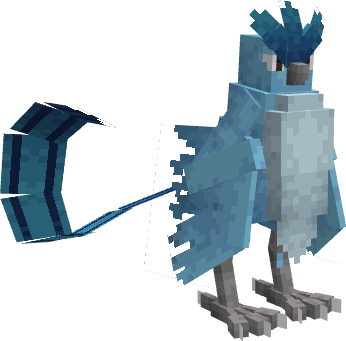
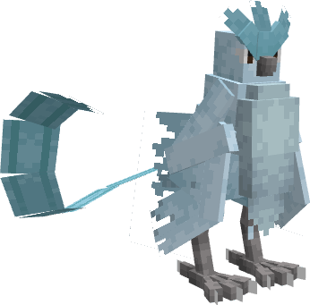

---
layout:
  title:
    visible: false
  description:
    visible: false
  tableOfContents:
    visible: true
  outline:
    visible: true
  pagination:
    visible: true
---

# Artikodin

***

### Statistiques 💠

| Niveau 🧪 | Points De Vie ❤️ | Dégâts 1 ⚔️ | Dégâts 2 ⚔️ |
| :-------: | :--------------: | :---------: | :---------: |
|     1     |        90        |      14     |      18     |
|     5     |       101.3      |     15.2    |     19.5    |
|     10    |       117.4      |     16.7    |     21.5    |
|     15    |       136.1      |     18.5    |     23.8    |
|     20    |       157.8      |     20.4    |     26.2    |


Ces statistiques concerne que votre compagnon.


***

### Loots 💰


Les Artikodin  sauvages pourront vous drop les items suivant ; \
\
[Armure d'Artikodin](../../equipement/armures/armure-dartikodin.md)  .png>) / .png>)

[Brise-Glace](../../equipement/armes/brise-glace.md) .png>) / .png>)\
Clé Donjon Artikodin \
Œuf d'Artikodin 


***

### Evolution 🔆


Artikodin  ne possède aucune évolution.


***

### Capacités  🏹


Artikodin  possède les attaques Eclats-Glace et Bise Glaciaire.


***

### Comment l'obtenir ❓


Vous pouvez obtenir Artikodin grâce à l'Œuf d'Artikodin  , ce dernier est obtenable en vainquant des boss Artikodin 


***

### Skins 🎨



<figure><figcaption>
Skin de base de Artikodin
</figcaption></figure>



<figure><figcaption>
Skin Shiny de Artikodin
</figcaption></figure>



***

### Historique 📖&#x20;

Ce Pokemon n'a reçu aucun correctif depuis sa sortie.
