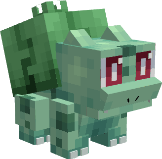
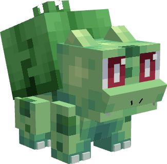

---
layout:
  title:
    visible: false
  description:
    visible: false
  tableOfContents:
    visible: true
  outline:
    visible: true
  pagination:
    visible: true
---

# Bulbizarre

***

### Statistiques 💠

| Niveau 🧪 | Points De Vie ❤️ | Dégâts ⚔️ |
| :-------: | :--------------: | :-------: |
|     1     |        20        |     3     |
|     5     |       22.5       |    3.2    |
|     10    |       26.1       |    3.6    |
|     15    |       30.2       |     4     |
|     20    |       35.1       |    4.4    |


Ces statistiques concerne que votre compagnon.


***

### Loots 💰


Les Bulbizarre  sauvages pourront vous drop les items suivant ; \
\
&#x20;1-20 PokeCoins 

Pièce d'[Armure de Florizarre](../../../equipement/armures/armure-de-florizarre.md)  &#x20;

[Sceptre Florazur](../../../equipement/armes/sceptre-florazur.md)  


***

### Evolution 🔆


Bulbizarre  évolue en [Herbizarre  ](a.md)à la fin du niveau 20.


***

### Capacités  🏹


Bulbizarre possède l'attaque charge.&#x20;


***

### Comment l'obtenir ❓


Vous pouvez obtenir Bulbizarre  en le choisissant comme Starter dans la première quête. (Aller parler à Pikachu au spawn) | **Réalisable qu'une fois**\
\
Vous pouvez également obtenir Bulbizarre  grâce à l'Œuf de Bulbizarre  , ce dernier est obtenable en vainquant les boss Florizarre  / Mega-Florizarre / Meca-Florizarre 


***

### Skins 🎨



<figure><figcaption>
Skin de base de Bulbizarre
</figcaption></figure>



<figure><figcaption>
Skin Shiny de Bulbizarre
</figcaption></figure>



***

### Historique 📖&#x20;

Ce Pokemon n'a reçu aucun correctif depuis sa sortie.
