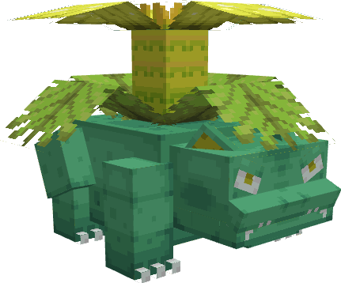

---
layout:
  title:
    visible: false
  description:
    visible: false
  tableOfContents:
    visible: true
  outline:
    visible: true
  pagination:
    visible: true
---

# Florizarre

***

### Statistiques 💠

| Niveau 🧪 | Points De Vie ❤️ | Dégâts 1 ⚔️ | Dégâts 2 ⚔️ |
| :-------: | :--------------: | :---------: | :---------: |
|     1     |       61.8       |      7      |     9.4     |
|     5     |       64.3       |     7.3     |     9.7     |
|     10    |       67.6       |     7.7     |     10.2    |
|     15    |        71        |     8.1     |     10.8    |
|     20    |       74.7       |     8.5     |     11.3    |


Ces statistiques concerne que votre compagnon.


***

### Loots 💰


Les Florizarre sauvages pourront vous drop les items suivant ; \
\
 1-30 PokeCoins \
Œuf de Bulbizarre \
Clé Donjon Mega-Florizarre 

Casque de Florizarre  

Pièce d'[Armure de Florizarre](../../../equipement/armures/armure-de-florizarre.md)   .png>) 

[Sceptre Florazur](../../../equipement/armes/sceptre-florazur.md)   / .png>)


***

### Evolution 🔆


Florizarre  évolue en Mega-Florizarre  à l'aide de la Florizarrite 


***

### Capacités  🏹


Florizarre  possède l'attaque Charge ainsi que l'attaque Fouet Lianes


***

### Comment l'obtenir ❓


Vous devez monter [Herbizarre ](a.md)au niveau 20 afin de le faire évoluer en Florizarre .


***

### Skins 🎨



<figure><figcaption>
Skin de base de Florizarre
</figcaption></figure>



<figure><figcaption>
Skin Shiny de Florizarre
</figcaption></figure>



***

### Historique 📖&#x20;

#### [Update 0.1](../../../pokedonjon/mise-a-jours.md#samedi-6-juillet-2024-or-m.a.j.-0.1-maintenance)

> jouts du casque de Florizarre  et du Sceptre Florazur &#x20;
