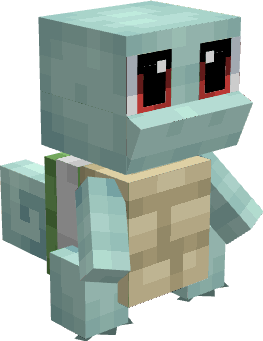

---
layout:
  title:
    visible: false
  description:
    visible: false
  tableOfContents:
    visible: true
  outline:
    visible: true
  pagination:
    visible: true
---

# Carapuce

***

### Statistiques 💠

| Niveau 🧪 | Points De Vie ❤️ | Dégâts ⚔️ |
| :-------: | :--------------: | :-------: |
|     1     |        18        |     4     |
|     5     |       20.3       |    4.3    |
|     10    |       23.5       |    4.8    |
|     15    |       27.3       |    5.3    |
|     20    |       30.6       |    5.8    |


Ces statistiques concerne que votre compagnon.


***

### Loots 💰


Les Carapuce  sauvages pourront vous drop les items suivant ; \
\
&#x20;1-20 PokeCoins 

Pièce d'[Armure de Tortank](../../../equipement/armures/armure-de-tortank.md)  &#x20;

L'[Hydro-Canon](../../../equipement/armes/hydro-canon.md) 


***

### Evolution 🔆


Carapuce   évolue en [Carabaffe  ](a.md)à la fin du niveau 20.


***

### Capacités  🏹


Carapuce   possède l'attaque Écras'Face.


***

### Comment l'obtenir ❓


Vous pouvez obtenir Carapuce en le choisissant comme Starter dans la première quête. (Aller parler à Pikachu au spawn) | **Réalisable qu'une fois**\
\
Vous pouvez également obtenir Carapuce  grâce à l'Œuf de Carapuce , ce dernier est obtenable en vainquant les boss Tortank  / Mega-Tortank   / Meca-Tortank 


***

### Skins 🎨



<figure><figcaption>
Skin de base de Carapuce
</figcaption></figure>



<figure><figcaption>
Skin Shiny de Carapuce
</figcaption></figure>



***

### Historique 📖&#x20;

Ce Pokemon n'a reçu aucun correctif depuis sa sortie.
