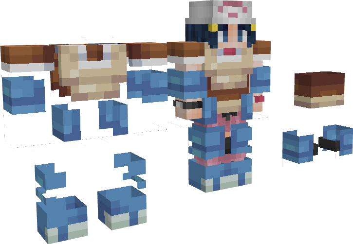
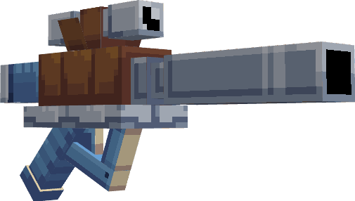
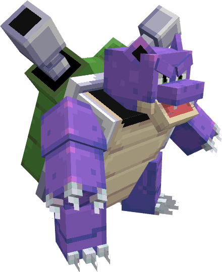

---
layout:
  title:
    visible: false
  description:
    visible: false
  tableOfContents:
    visible: true
  outline:
    visible: true
  pagination:
    visible: true
---

# Tortank

***

### Statistiques 💠

| Niveau 🧪 | Points De Vie ❤️ | Dégâts 1 ⚔️ | Dégâts 2 ⚔️ |
| :-------: | :--------------: | :---------: | :---------: |
|     1     |        53        |     9.4     |     12.5    |
|     5     |       55.1       |     9.7     |      13     |
|     10    |       57.9       |     10.2    |     13.6    |
|     15    |       60.9       |     10.8    |     14.3    |
|     20    |       63.4       |     11.3    |     15.1    |


Ces statistiques concerne que votre compagnon.


***

### Loots 💰


Les Tortank   sauvages pourront vous drop les items suivant ; \
\
&#x20;1-30 PokeCoins \
Œuf de Carapuce \
Clé Donjon Mega-Tortank 

Casque de Tortank  

Pièce d'[Armure de Tortank](../../../equipement/armures/armure-de-tortank.md)  .png>)&#x20;

&#x20;L'[Hydro-Canon](../../../equipement/armes/hydro-canon.md)    / .png>)


***

### Evolution 🔆


Tortank  évolue en Mega-Tortank  à l'aide de la Tortankite &#x20;


***

### Capacités  🏹


Tortank   possède l'attaque Écras'Face ainsi que l'attaque Hydrocanon.


***

### Comment l'obtenir ❓


Vous devez monter [Carabaffe](a.md)  au niveau afin de le faire évoluer en Tortank &#x20;


***

### Skins 🎨



<figure><figcaption>
Skin de base de Tortank
</figcaption></figure>



<figure><figcaption>
Skin Shiny de Tortank
</figcaption></figure>



***

### Historique 📖&#x20;

#### [Update 0.1](../../../pokedonjon/mise-a-jours.md#samedi-6-juillet-2024-or-m.a.j.-0.1-maintenance)

> Ajouts du casque de Tortank  et du Hydro-Canon &#x20;
