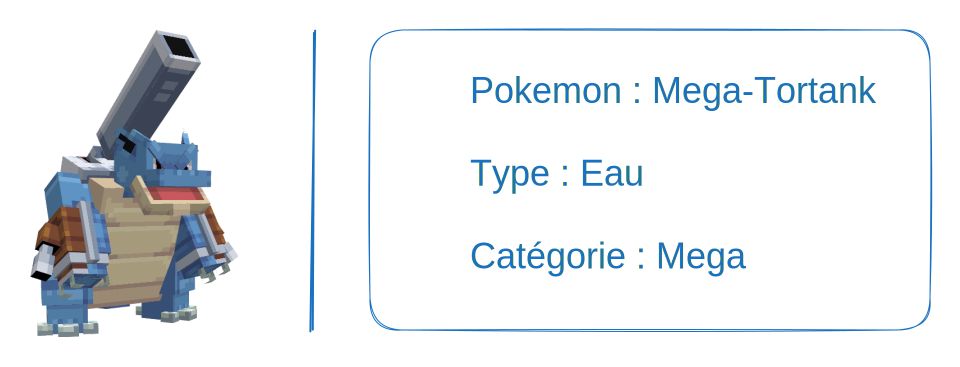

---
layout:
  title:
    visible: false
  description:
    visible: false
  tableOfContents:
    visible: true
  outline:
    visible: true
  pagination:
    visible: true
---

# Mega-Tortank

***

### Statistiques 💠

| Niveau 🧪 | Points De Vie ❤️ | Dégâts 1 ⚔️ | Dégâts 2 ⚔️ |
| :-------: | :--------------: | :---------: | :---------: |
|     1     |       79.2       |     14.1    |     18.8    |
|     5     |       82.4       |     14.7    |     19.6    |
|     10    |       86.6       |     15.5    |     20.6    |
|     15    |        91        |     16.2    |     21.7    |
|     20    |       95.7       |     17.1    |     22.8    |


Ces statistiques concerne que votre compagnon.


***

### Loots 💰


Les Mega-Tortank    sauvages pourront vous drop les items suivant ; \
\
Œuf de Carapuce \
Clé Donjon Meca-Tortank \
Tortankite 

Pièce d'[Armure de Tortank](../../../equipement/armures/armure-de-tortank.md)  .png>) / 

&#x20;L'[Hydro-Canon](../../../equipement/armes/hydro-canon.md)  .png>) / .png>)&#x20;


***

### Evolution 🔆


Mega-Tortank  est le dernier stade de sa ligne évolutive.


***

### Capacités  🏹


Mega-Tortank   possède l'attaque Écras'Face ainsi que l'attaque Hydrocanon.


***

### Comment l'obtenir ❓


Vous devez faire évoluer Tortank   en Mega-Tortank  à l'aide de la Tortankite 


***

### Skins 🎨



<figure><figcaption>
Skin de base de Mega-Tortank
</figcaption></figure>







***

### Historique 📖&#x20;

#### [Update 0.1](../../../pokedonjon/mise-a-jours.md#samedi-6-juillet-2024-or-m.a.j.-0.1-maintenance)

> &#x20;Ajout de la rareté .png>) pour les Pièces d'Armure de Tortank et Hydro-Canon.
