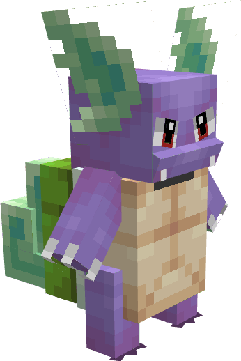

---
layout:
  title:
    visible: false
  description:
    visible: false
  tableOfContents:
    visible: true
  outline:
    visible: true
  pagination:
    visible: true
---

# Carabaffe

***

### Statistiques 💠

| Niveau 🧪 | Points De Vie ❤️ | Dégâts ⚔️ |
| :-------: | :--------------: | :-------: |
|     1     |       33.7       |    6.4    |
|     5     |       36.5       |    6.8    |
|     10    |       40.3       |    7.3    |
|     15    |       44.5       |    7.9    |
|     20    |       48.1       |    8.5    |


Ces statistiques concerne que votre compagnon.


***

### Loots 💰


Les Carabaffe  sauvages pourront vous drop les items suivant ; \
\
&#x20;1-20 PokeCoins 

Pièce d'[Armure de Tortank](../../../equipement/armures/armure-de-tortank.md)  &#x20;

L'[Hydro-Canon](../../../equipement/armes/hydro-canon.md)  &#x20;


***

### Evolution 🔆


Carabaffe   évolue en [Tortank](a-1.md)  à la fin du niveau 20.


***

### Capacités  🏹


Carabaffe   possède l'attaque Écras'Face.


***

### Comment l'obtenir ❓


Vous devez monter [Carapuce](./)  au niveau 20 afin de le faire évoluer en Carabaffe &#x20;


***

### Skins 🎨



<figure><figcaption>
Skin de base de Carabaffe
</figcaption></figure>



<figure><figcaption>
Skin Shiny de Carabaffe
</figcaption></figure>



***

### Historique 📖&#x20;

#### [Update 0.1](../../../pokedonjon/mise-a-jours.md#samedi-6-juillet-2024-or-m.a.j.-0.1-maintenance)

> &#x20;Retrait de la rareté .png>) pour l'Armure de Tortank et l'Hydro-Canon.
