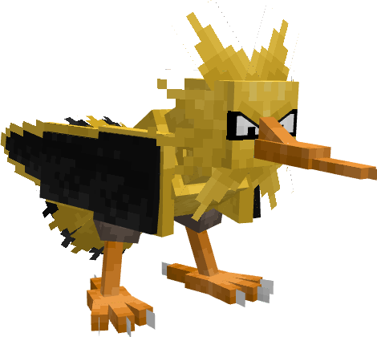
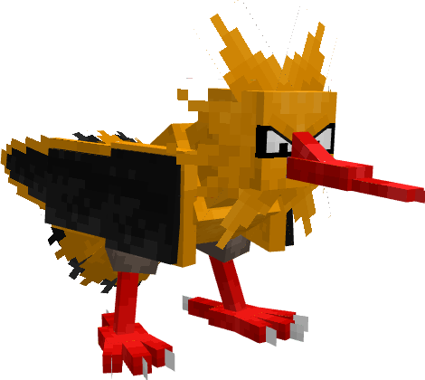

---
layout:
  title:
    visible: false
  description:
    visible: false
  tableOfContents:
    visible: true
  outline:
    visible: true
  pagination:
    visible: true
---

# Electhor

***

### Statistiques 💠

| Niveau 🧪 | Points De Vie ❤️ | Dégâts 1 ⚔️ | Dégâts 2 ⚔️ |
| :-------: | :--------------: | :---------: | :---------: |
|     1     |        85        |      13     |     16.6    |
|     5     |       95.7       |     14.1    |      18     |
|     10    |       110.9      |     15.5    |     19.8    |
|     15    |       128.6      |     17.2    |     21.9    |
|     20    |        149       |     18.9    |     242     |


Ces statistiques concerne que votre compagnon.


***

### Loots 💰


Les Electhor  sauvages pourront vous drop les items suivant ; \
\
[Armure d'Electhor](../../equipement/armures/armure-delecthor.md) .png>) / .png>)

[Scepthor](../../equipement/armes/scepthor.md).png>) / .png>)\
Clé Donjon Electhor \
Œuf d'Electhor 


***

### Evolution 🔆


Electhor ne possède aucune évolution.


***

### Capacités  🏹


Electhor  possède les attaques Boule Élek et Fatal-Foudre.


***

### Comment l'obtenir ❓


Vous pouvez obtenir Electhor  grâce à l'Œuf d'Electhor  , ce dernier est obtenable en vainquant des boss Electhor 


***

### Skins 🎨



<figure><figcaption>
Skin de base de Electhor
</figcaption></figure>



<figure><figcaption>
Skin Shiny de Electhor
</figcaption></figure>



***

### Historique 📖&#x20;

Ce Pokemon n'a reçu aucun correctif depuis sa sortie.
