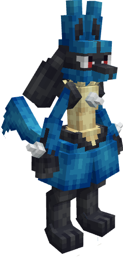
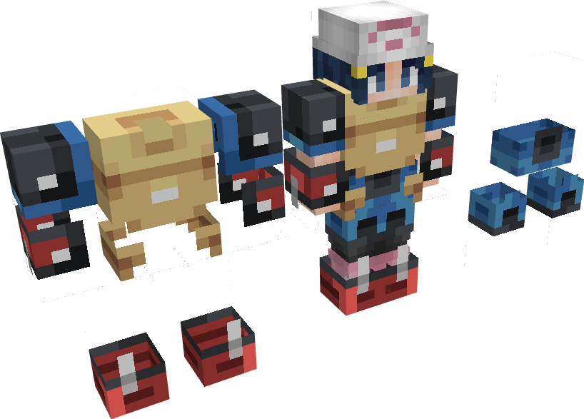
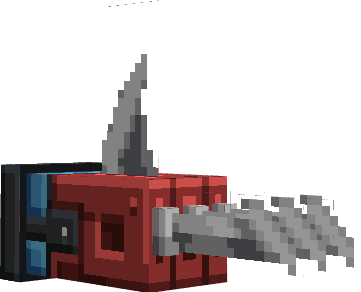
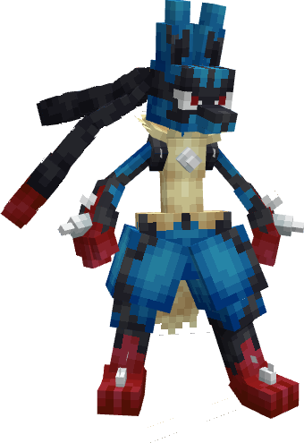
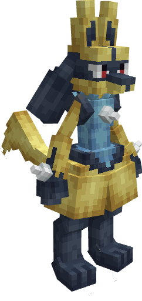
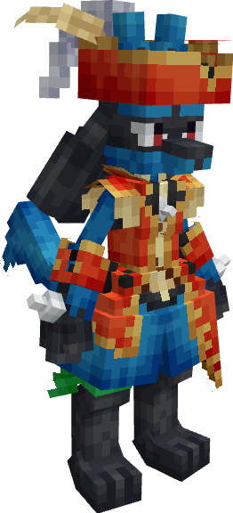
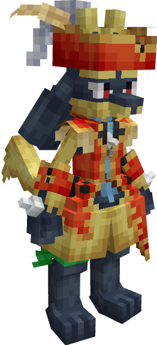
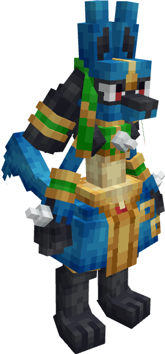
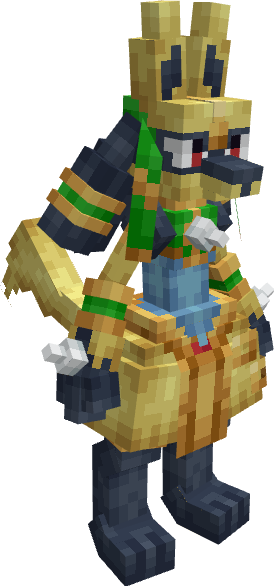
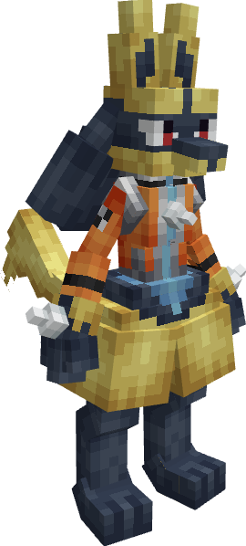

---
layout:
  title:
    visible: false
  description:
    visible: false
  tableOfContents:
    visible: true
  outline:
    visible: true
  pagination:
    visible: true
---

# Lucario

***

### Statistiques 💠

| Niveau 🧪 | Points De Vie ❤️ | Dégâts 1 ⚔️ | Dégâts 2 ⚔️ |
| :-------: | :--------------: | :---------: | :---------: |
|     1     |        46        |      8      |     10.7    |
|     5     |       49.79      |     8.49    |     11.3    |
|     10    |       54.79      |     9.15    |     12.2    |
|     15    |       60.70      |     9.85    |     13.1    |
|     20    |       67.01      |    10.62    |     14.1    |


Ces statistiques concerne que votre compagnon.


***

### Loots 💰


Les Lucario  sauvages pourront vous drop les items suivant ; \
\
1-20 PokeCoins \
[Armure de Lucario](../../../equipement/armures/armure-de-lucario.md)  .png>)/ .png>)\
[Griffe D'Aura](../../../equipement/armes/griffe-daura.md)  .png>)/ .png>)\
Clé Donjon Mega-Lucario \
Œuf de Lucario 


***

### Evolution 🔆


Lucario  évolue en [Mega-Lucario](a.md)  à l'aide de la Lucarite 


***

### Capacités  🏹


Lucario  possède les attaques Close Combat et Aurasphère.


***

### Comment l'obtenir ❓


Vous pouvez obtenir Lucario   grâce à l'Œuf de Lucario  , ce dernier est obtenable en vainquant des Lucario   ou des boss Mega-Lucario &#x20;


***

### Skins 🎨



<figure><figcaption>
Skin de base de Lucario
</figcaption></figure>



<figure><figcaption>
Skin Shiny de Lucario
</figcaption></figure>






&#x20;                                                              Obtenable (Limité)


<figure><figcaption>
Skin Pirate de Lucario
</figcaption></figure>


Le Skin Pirate de Lucario est obtenable dans le pack "Pirate" disponible jusqu'au xx/xx/xx.&#x20;





&#x20;                                                              Obtenable (Limité)


<figure><figcaption>
Skin Shiny Pirate de Lucario
</figcaption></figure>


Le Skin Shiny Pirate de Lucario est obtenable dans le pack "Pirate Premium" disponible jusqu'au xx/xx/xx.&#x20;







&#x20;                                                              Obtenable (Limité)


<figure><figcaption>
Skin Anubis de Lucario
</figcaption></figure>


Le Skin Anubis de Lucario est obtenable au tier XX du premier BattlePass Premium disponible du xx/xx/xxxx jusqu'au xx/xx/xxxx.





&#x20;                                                              Obtenable (Limité)


<figure><figcaption>
Skin Anubis de Lucario
</figcaption></figure>


N/A







&#x20;                                                              Obtenable (Limité)


<figure><figcaption>
Skin Espace de Lucario
</figcaption></figure>


Le Skin Espace de Lucario est obtenable au tier XX du premier BattlePass disponible du xx/xx/xxxx jusqu'au xx/xx/xxxx.





&#x20;                                                              Obtenable (Limité)


<figure><figcaption>
Skin Shiny Espace de Lucario
</figcaption></figure>


N/A




***

### Historique 📖&#x20;

#### [Update 0.1](../../../pokedonjon/mise-a-jours.md#samedi-6-juillet-2024-or-m.a.j.-0.1-maintenance)

> &#x20;Retrait de la rareté .png>) pour l'Armure de Lucario et la Griffe D'Aura.
