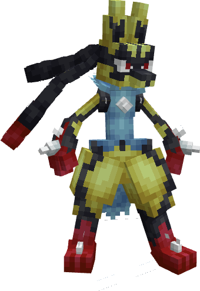

---
layout:
  title:
    visible: false
  description:
    visible: false
  tableOfContents:
    visible: true
  outline:
    visible: true
  pagination:
    visible: true
---

# Mega-Lucario

***

### Statistiques 💠

| Niveau 🧪 | Points De Vie ❤️ | Dégâts 1 ⚔️ | Dégâts 2 ⚔️ |
| :-------: | :--------------: | :---------: | :---------: |
|     1     |       83.8       |     13.3    |     16.7    |
|     5     |       87.2       |     13.8    |     17.4    |
|     10    |       91.6       |     14.5    |     18.3    |
|     15    |       96.3       |     15.3    |     19.2    |
|     20    |       101.2      |      16     |      20     |


Ces statistiques concerne que votre compagnon.


***

### Loots 💰


Les Mega-Steelix  sauvages pourront vous drop les items suivant ; \
\
[Armure de Lucario](../../../equipement/armures/armure-de-lucario.md)  .png>)  / .png>) / .png>)\
[Griffe D'Aura](../../../equipement/armes/griffe-daura.md)  .png>)  / .png>) / .png>)\
Lucarite\
Œuf de Lucario  


***

### Evolution 🔆


Mega-Lucario est le dernier stade d'évolution de sa famille.


***

### Capacités  🏹


Mega-Lucario  possède les attaques Close Combat et Aurasphère.


***

### Comment l'obtenir ❓


Vous devez évoluer [Lucario](./)  à l'aide de la Lucarite 


***

### Skins 🎨



<figure><figcaption>
Skin de base de Mega-Lucario
</figcaption></figure>



<figure><figcaption>
Skin Shiny de Mega-Lucario
</figcaption></figure>



***

### Historique 📖&#x20;

#### [Update 0.1](../../../pokedonjon/mise-a-jours.md#samedi-6-juillet-2024-or-m.a.j.-0.1-maintenance)

> Ajout de la rareté .png>) pour l'Armure de Lucario et la Griffe D'Aura.
