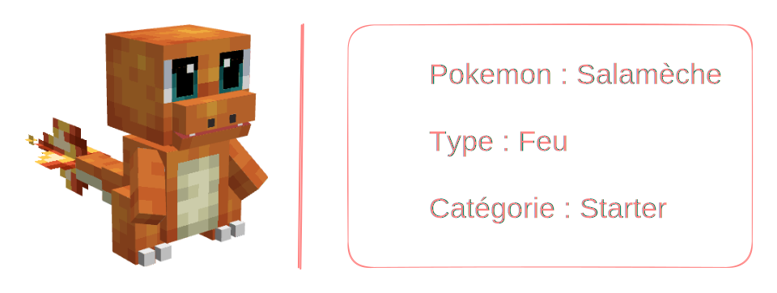
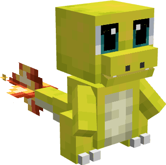

---
layout:
  title:
    visible: false
  description:
    visible: false
  tableOfContents:
    visible: true
  outline:
    visible: true
  pagination:
    visible: true
---

# Salamèche

***

### Statistiques 💠

| Niveau 🧪 | Points De Vie ❤️ | Dégâts ⚔️ |
| :-------: | :--------------: | :-------: |
|     1     |        16        |    3.5    |
|     5     |        18        |    3.8    |
|     10    |       20.9       |    4.2    |
|     15    |       24.2       |    4.6    |
|     20    |       28.1       |    5.1    |


Ces statistiques concerne que votre compagnon.


***

### Loots 💰


Les Salamèche  sauvages pourront vous drop les items suivant ; \
\
&#x20;1-20 PokeCoins 

Pièce d'[Armure de Dracaufeu](../../../equipement/armures/armure-de-dracaufeu.md)  &#x20;

[Epée Draconique](../../../equipement/armes/epee-draconique.md)  


***

### Evolution 🔆


Salamèche  évolue en [Reptincel  ](a.md)à la fin du niveau 20.


***

### Capacités  🏹


Salamèche  possède l'attaque Griffe.


***

### Comment l'obtenir ❓


Vous pouvez obtenir Salamèche  en le choisissant comme Starter dans la première quête. (Aller parler à Pikachu au spawn) | **Réalisable qu'une fois**\
\
Vous pouvez également obtenir Salamèche  grâce à l'Œuf de Salamèche  , ce dernier est obtenable en vainquant les boss Dracaufeu  / Mega-Dracaufeu   / Meca-Dracaufeu 


***

### Skins 🎨



<figure><figcaption>
Skin de base de Salamèche
</figcaption></figure>



<figure><figcaption>
Skin Shiny de Salamèche
</figcaption></figure>



***

### Historique 📖&#x20;

Ce Pokemon n'a reçu aucun correctif depuis sa sortie.
