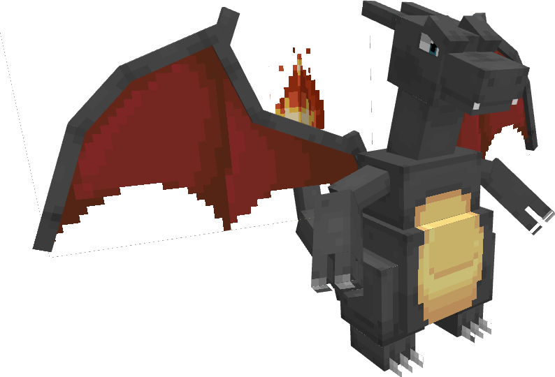

---
layout:
  title:
    visible: false
  description:
    visible: false
  tableOfContents:
    visible: true
  outline:
    visible: true
  pagination:
    visible: true
---

# Dracaufeu

***

### Statistiques 💠

| Niveau 🧪 | Points De Vie ❤️ | Dégâts 1 ⚔️ | Dégâts 2 ⚔️ |
| :-------: | :--------------: | :---------: | :---------: |
|     1     |       49.5       |     8.2     |     10.9    |
|     5     |       51.5       |     8.5     |     11.4    |
|     10    |       54.1       |      9      |     11.9    |
|     15    |       56.9       |     9.4     |     12.6    |
|     20    |       59.9       |     9.9     |     13.2    |


Ces statistiques concerne que votre compagnon.


***

### Loots 💰


Les Dracaufeu   sauvages pourront vous drop les items suivant ; \
\
&#x20;1-30 PokeCoins \
Œuf de Salamèche \
Clé Donjon Mega-Dracaufeu 

Casque de Dracaufeu  

Pièce d'[Armure de Dracaufeu](../../../equipement/armures/armure-de-dracaufeu.md)   .png>)&#x20;

&#x20;[Epée Draconique](../../../equipement/armes/epee-draconique.md)    / .png>)


***

### Evolution 🔆


Dracaufeu  évolue en Mega-Dracaufeu  à l'aide de la Dracaufite


***

### Capacités  🏹


Dracaufeu   possède l'attaque Tranche ainsi que l'attaque Tir de flamme.\
\
Son attaque "Tir de flamme" inflige un effet de brûlure à la cible.


***

### Comment l'obtenir ❓


Vous devez monter [Reptincel  ](a.md)au niveau 20 afin de le faire évoluer en Dracaufeu &#x20;


***

### Skins 🎨



<figure><figcaption>
Skin de base de Dracaufeu
</figcaption></figure>



<figure><figcaption>
Skin Shiny de Dracaufeu
</figcaption></figure>



***

### Historique 📖&#x20;

#### [Update 0.1](../../../pokedonjon/mise-a-jours.md#samedi-6-juillet-2024-or-m.a.j.-0.1-maintenance)

> Ajouts du casque de Dracaufeu  et de l'épée Draconique &#x20;
