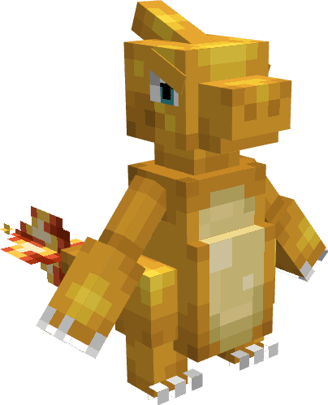

---
layout:
  title:
    visible: false
  description:
    visible: false
  tableOfContents:
    visible: true
  outline:
    visible: true
  pagination:
    visible: true
---

# Reptincel

***

### Statistiques 💠

| Niveau 🧪 | Points De Vie ❤️ | Dégâts ⚔️ |
| :-------: | :--------------: | :-------: |
|     1     |       30.9       |    5.6    |
|     5     |       33.4       |     6     |
|     10    |       36.9       |    6.4    |
|     15    |       40.7       |    6.9    |
|     20    |        45        |    7.4    |


Ces statistiques concerne que votre compagnon.


***

### Loots 💰


Les Reptincel  sauvages pourront vous drop les items suivant ; \
\
&#x20;1-20 PokeCoins 

Pièce d'[Armure de Dracaufeu](../../../equipement/armures/armure-de-dracaufeu.md)  &#x20;

[Epée Draconique](../../../equipement/armes/epee-draconique.md)  &#x20;


***

### Evolution 🔆


Reptincel  évolue en [Dracaufeu  ](a-1.md)à la fin du niveau 20.


***

### Capacités  🏹


Reptincel  possède l'attaque Tranche.


***

### Comment l'obtenir ❓


Vous devez monter [Salamèche  ](./)au niveau 20 afin de le faire évoluer en Reptincel 


***

### Skins 🎨



<figure><figcaption>
Skin de base de Reptincel
</figcaption></figure>



<figure><figcaption>
Skin Shiny de Reptincel
</figcaption></figure>



***

### Historique 📖&#x20;

#### [Update 0.1](../../../pokedonjon/mise-a-jours.md#samedi-6-juillet-2024-or-m.a.j.-0.1-maintenance)

> &#x20; Retrait de la rareté .png>) pour l'Armure de Dracaufeu et l'épée Draconique.
