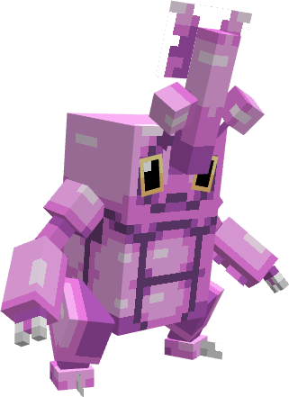

---
layout:
  title:
    visible: false
  description:
    visible: false
  tableOfContents:
    visible: true
  outline:
    visible: true
  pagination:
    visible: true
---

# Scarhino

***

### Statistiques 💠

| Niveau 🧪 | Points De Vie ❤️ | Dégâts 1 ⚔️ | Dégâts 2 ⚔️ |
| :-------: | :--------------: | :---------: | :---------: |
|     1     |        52        |      9      |      11     |
|     5     |       56.3       |     9.6     |     11.7    |
|     10    |       62.1       |     10.3    |     12.6    |
|     15    |       68.6       |     11.1    |     13.5    |
|     20    |       75.8       |      12     |     14.6    |


Ces statistiques concerne que votre compagnon.


***

### Loots 💰


Les Scarhino  sauvages pourront vous drop les items suivant ; \
\
1-20 PokeCoins \
[Armure de Scarhino](../../../equipement/armures/armure-de-scarhino.md)  .png>)/ .png>)\
[Epieu Scarabéique](../../../equipement/armes/epieu-scarabique.md)  .png>)/ .png>)\
Clé Donjon Scarhino \
Œuf de Scarhino 


***

### Evolution 🔆


Scarhino  évolue en [Mega-Scarhino](a.md)  à l'aide de la Scarhinoïte 


***

### Capacités  🏹


Scarhino  possède les attaques Uppercut et Dard Venin.


***

### Comment l'obtenir ❓


Vous pouvez obtenir Scarhino  grâce à l'Œuf de Scarhino , ce dernier est obtenable en vainquant des Scarhino  ou des boss Mega-Scarhino 


***

### Skins 🎨



<figure><figcaption>
Skin de base de Scarhino
</figcaption></figure>



<figure><figcaption>
Skin Shiny de Scarhino
</figcaption></figure>



***

### Historique 📖&#x20;

#### [Update 0.1](../../../pokedonjon/mise-a-jours.md#samedi-6-juillet-2024-or-m.a.j.-0.1-maintenance)

> &#x20; Retrait de la rareté .png>) pour l'Armure de Scarhino et L'épieu Scarabéique.
