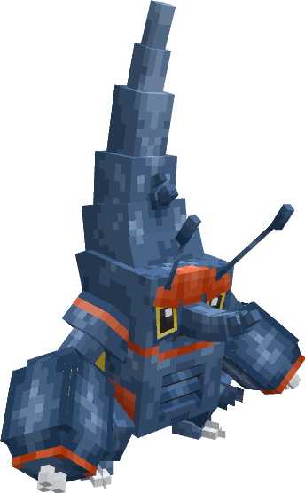
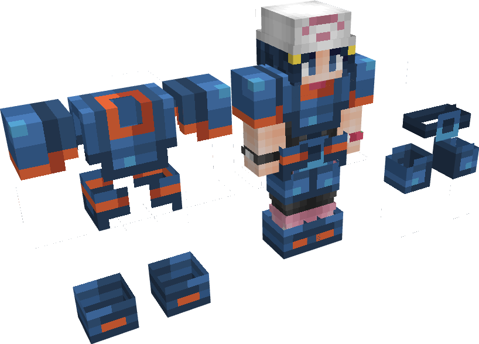
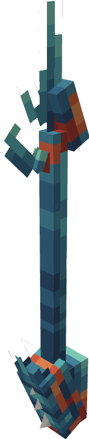
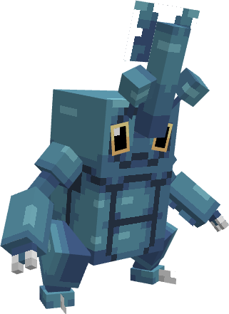
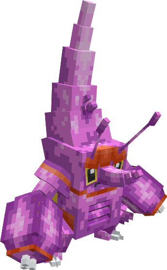

---
layout:
  title:
    visible: false
  description:
    visible: false
  tableOfContents:
    visible: true
  outline:
    visible: true
  pagination:
    visible: true
---

# Mega-Scarhino

***

### Statistiques 💠

| Niveau 🧪 | Points De Vie ❤️ | Dégâts 1 ⚔️ | Dégâts 1 ⚔️ |
| :-------: | :--------------: | :---------: | :---------: |
|     1     |       94.7       |     14.9    |     17.9    |
|     5     |       98.5       |     15.5    |     18.6    |
|     10    |       103.6      |     16.3    |     19.6    |
|     15    |       108.9      |     17.2    |     20.6    |
|     20    |       114.4      |      18     |     21.6    |


Ces statistiques concerne que votre compagnon.


***

### Loots 💰


Les Mega-Scarhino  sauvages pourront vous drop les items suivant ; \
\
[Armure de Scarhino](../../../equipement/armures/armure-de-scarhino.md) .png>) / .png>) / .png>)\
[Epieu Scarabéique](../../../equipement/armes/epieu-scarabique.md)   .png>) / .png>) / .png>)\
Scarhinoïte \
Œuf de Scarhino 


***

### Evolution 🔆


Mega-Scarhino  est le dernier stade d'évolution de sa famille.


***

### Capacités  🏹


Mega-Scarhino  possède les attaques Uppercut et Dard Venin.


***

### Comment l'obtenir ❓


Vous devez évoluer [Scarhino  ](./)à l'aide de la Scarhinoïte 


***

### Skins 🎨



<figure><figcaption>
Skin de base de Mega-Scarhino
</figcaption></figure>



<figure><figcaption>
Skin Shiny de Mega-Scarhino
</figcaption></figure>



***

### Historique 📖&#x20;

#### [Update 0.1](../../../pokedonjon/mise-a-jours.md#samedi-6-juillet-2024-or-m.a.j.-0.1-maintenance)

> &#x20; Ajout de la rareté .png>) pour l'Armure de Scarhino et L'épieu Scarabéique.
