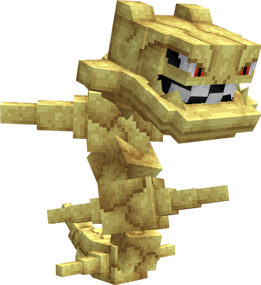

---
layout:
  title:
    visible: false
  description:
    visible: false
  tableOfContents:
    visible: true
  outline:
    visible: true
  pagination:
    visible: true
---

# Steelix

***

### Statistiques 💠

| Niveau 🧪 | Points De Vie ❤️ | Dégâts 1 ⚔️ | Dégâts 2 ⚔️ |
| :-------: | :--------------: | :---------: | :---------: |
|     1     |        65        |      10     |     13.3    |
|     5     |       70.4       |     10.6    |     14.1    |
|     10    |       77.7       |     11.4    |     15.2    |
|     15    |       85.8       |     12.3    |     16.4    |
|     20    |       94.7       |     13.3    |     17.6    |


Ces statistiques concerne que votre compagnon.


***

### Loots 💰


Les Steelix   sauvages pourront vous drop les items suivant ; \
\
1-20 PokeCoins \
[Armure de Steelix](../../../equipement/armures/armure-de-steelix.md)  .png>)/ .png>)\
[Hache de Métallumière](../../../equipement/armes/hache-de-metallumiere.md)   .png>)/ .png>)\
Clé Donjon Steelix \
Œuf de Steelix 


***

### Evolution 🔆


Steelix  évolue en [Mega-Steelix](a.md)  à l'aide de la Steelixite 


***

### Capacités  🏹


Steelix  possède les attaques Piétisol et Jet-Pierres.


***

### Comment l'obtenir ❓


Vous pouvez obtenir Steelix grâce à l'Œuf de Steelix , ce dernier est obtenable en vainquant des Steelix  ou des boss Mega-Steelix 


***

### Skins 🎨



<figure><figcaption>
Skin de base de Steelix
</figcaption></figure>



<figure><figcaption>
Skin Shiny de Steelix
</figcaption></figure>



### Historique 📖&#x20;

#### [Update 0.1](../../../pokedonjon/mise-a-jours.md#samedi-6-juillet-2024-or-m.a.j.-0.1-maintenance)

> &#x20;Retrait de la rareté .png>) pour l'Armure de Steelix et la hache de Métallumière.
