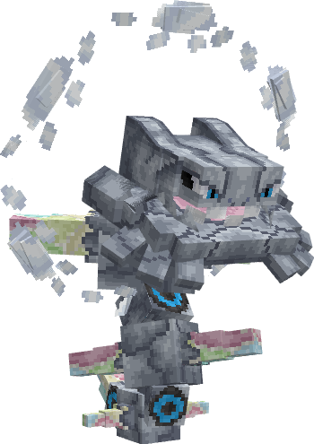
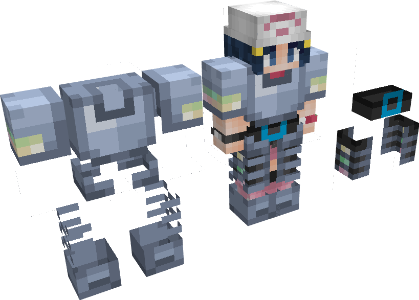
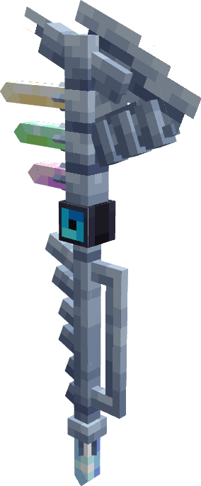
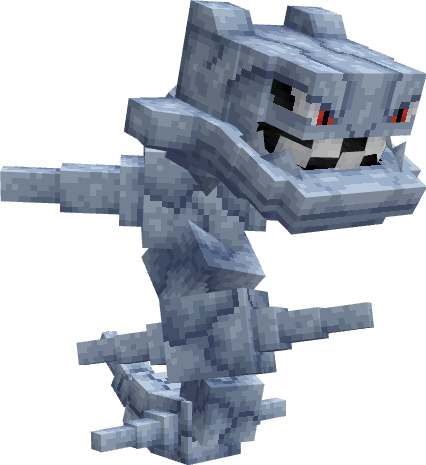
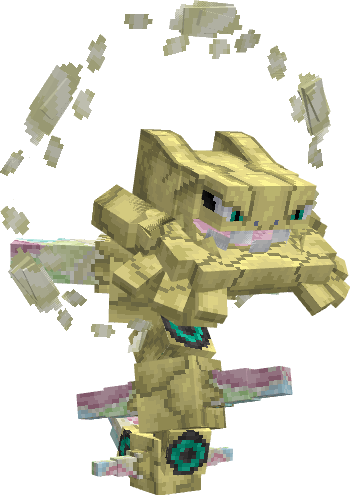

---
layout:
  title:
    visible: false
  description:
    visible: false
  tableOfContents:
    visible: true
  outline:
    visible: true
  pagination:
    visible: true
---

# Mega-Steelix

***

### Statistiques 💠

| Niveau 🧪 | Points De Vie ❤️ | Dégâts 1 ⚔️ | Dégâts 2 ⚔️ |
| :-------: | :--------------: | :---------: | :---------: |
|     1     |       118.4      |     15.6    |     18.1    |
|     5     |       123.2      |     16.2    |     18.8    |
|     10    |       129.5      |     17.1    |     19.8    |
|     15    |       136.1      |     17.9    |     20.8    |
|     20    |        143       |     18.8    |     21.9    |


Ces statistiques concerne que votre compagnon.


***

### Loots 💰


Les Mega-Steelix  sauvages pourront vous drop les items suivant ; \
\
[Armure de Steelix](../../../equipement/armures/armure-de-steelix.md) .png>) / .png>) / .png>)\
[Hache de Métallumière](../../../equipement/armes/hache-de-metallumiere.md)   .png>) / .png>) / .png>)\
Steelixite \
Œuf de Steelix &#x20;


***

### Evolution 🔆


Mega-Steelix  est le dernier stade d'évolution de sa famille.


***

### Capacités  🏹


Mega-Steelix  possède les attaques Séisme et Luminocanon


***

### Comment l'obtenir ❓


Vous devez évoluer [Steelix](./)  à l'aide de la Steelixite 


***

### Skins 🎨



<figure><figcaption>
Skin de base de Mega-Seelix
</figcaption></figure>



<figure><figcaption>
Skin Shiny de Mega-Steelix
</figcaption></figure>



***

### Historique 📖&#x20;

#### [Update 0.1](../../../pokedonjon/mise-a-jours.md#samedi-6-juillet-2024-or-m.a.j.-0.1-maintenance)

> &#x20;Ajout de la rareté .png>) pour l'Armure de Steelix et la hache de Métallumière.
