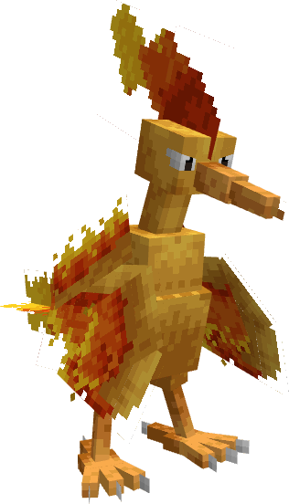
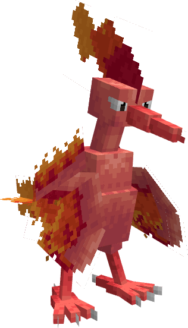

---
layout:
  title:
    visible: false
  description:
    visible: false
  tableOfContents:
    visible: true
  outline:
    visible: true
  pagination:
    visible: true
---

# Sulfura

***

### Statistiques 💠

| Niveau 🧪 | Points De Vie ❤️ | Dégâts 1 ⚔️ | Dégâts 2 ⚔️ |
| :-------: | :--------------: | :---------: | :---------: |
|     1     |        85        |      13     |     16.6    |
|     5     |       95.7       |     14.1    |      18     |
|     10    |       110.9      |     15.5    |     19.8    |
|     15    |       128.6      |     17.2    |     21.9    |
|     20    |        149       |     18.9    |     24.2    |


Ces statistiques concerne que votre compagnon.


***

### Loots 💰


Les Sulfura  sauvages pourront vous drop les items suivant ; \
\
[Armure de Sulfura](../../equipement/armures/armure-de-sulfura.md) .png>) / .png>)

[Lame Du Phoenix](../../equipement/armes/lame-du-phoenix.md) .png>) / .png>)\
Clé Donjon Sulfura \
Œuf de Sulfura 


***

### Evolution 🔆


Sulfura  ne possède aucune évolution.


***

### Capacités  🏹


Sulfura  possède les attaques Rebondifeu et Surchauffe.


***

### Comment l'obtenir ❓


Vous pouvez obtenir Sulfura  grâce à l'Œuf de Sulfura  , ce dernier est obtenable en vainquant des boss Sulfura 


***

### Skins 🎨



<figure><figcaption>
Skin de base de Sulfura
</figcaption></figure>



<figure><figcaption>
Skin Shiny de Sulfura
</figcaption></figure>



***

### Historique 📖&#x20;

Ce Pokemon n'a reçu aucun correctif depuis sa sortie.
